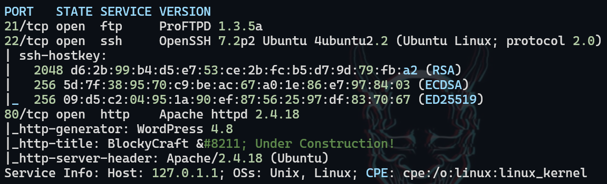
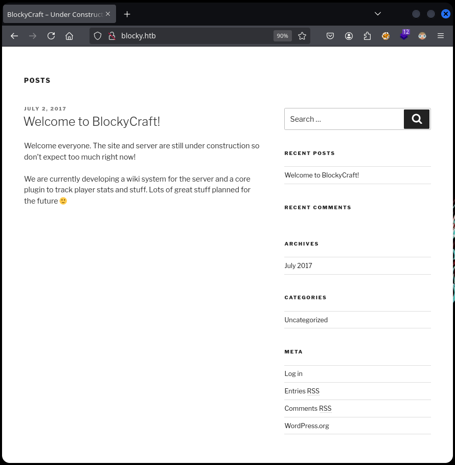
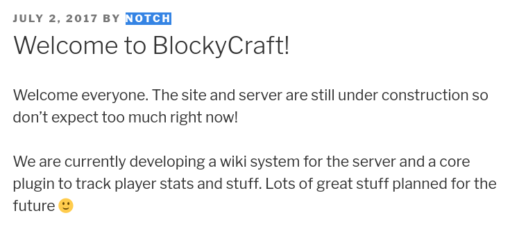
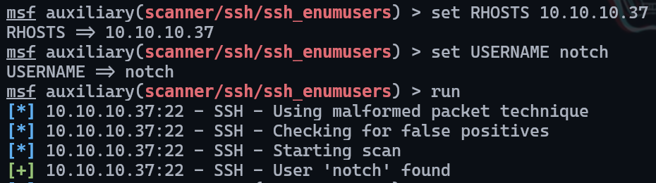
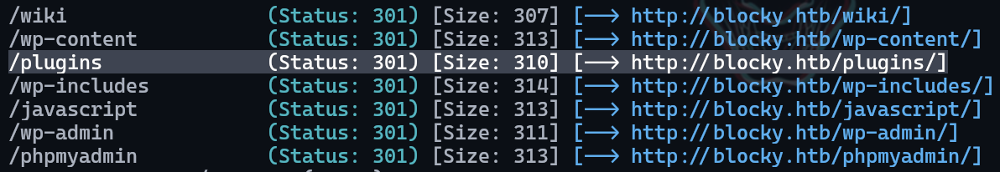
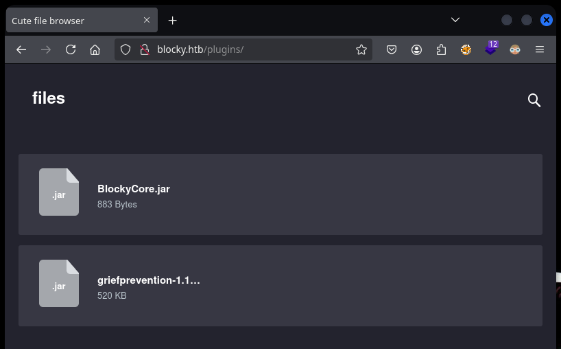
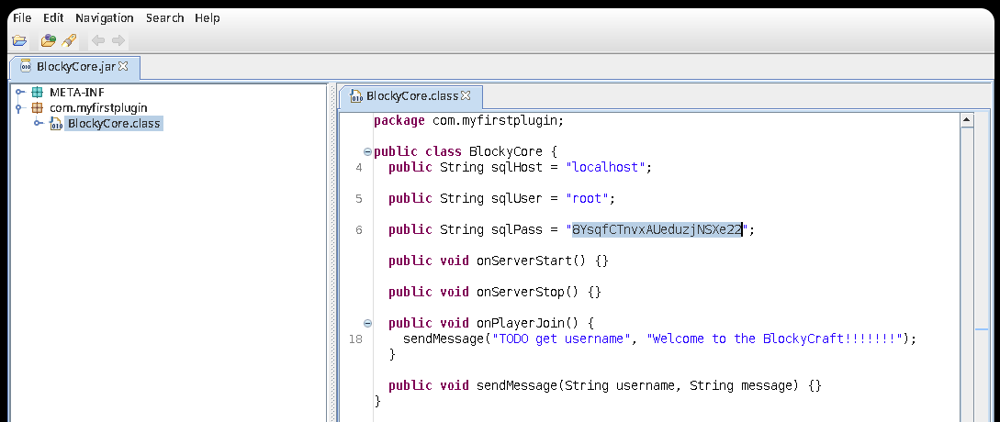
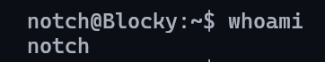
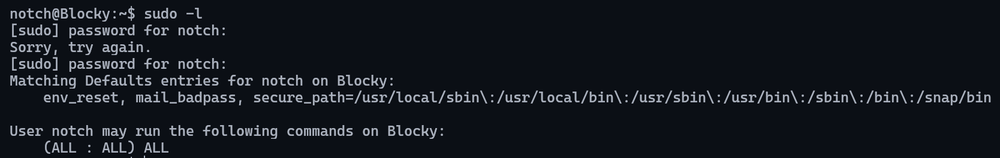
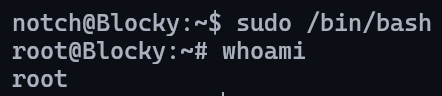

# Blocky

___

**Key Findings:**
- Sensitive Java archive files accessible via web directory
- Hardcoded database credentials in BlockyCore.jar application
- SSH service vulnerable to username enumeration (OpenSSH 7.2)
- Unrestricted sudo privileges for compromised user account

---

## Key Learning Objectives

✅ Port Scanning & Service Enumeration  
✅ WordPress Content Management System Analysis  
✅ Web Directory Fuzzing & Discovery  
✅ Java Archive Reverse Engineering  
✅ SSH Username Enumeration Techniques  
✅ Credential Extraction from Java Applications  
✅ Privilege Escalation via Sudo Misconfiguration

---

## 1. Reconnaissance & Enumeration

Initial reconnaissance was conducted using ``nmap`` to identify open ports and running services.

```bash
sudo nmap --top-ports=100 --open -n -Pn -vvv -oG ports 10.10.10.37
sudo nmap -p 21,22,80 -sCV -oN services 10.10.10.37
```

**Results:**
- Port 21/tcp: FTP service
- Port 22/tcp: SSH service (OpenSSH 7.2)
- Port 80/tcp: Apache HTTP server

<figure style="text-align: center;">
    
</figure>

## 2. Web Application Assessment

Browser examination revealed a WordPress content management system with active blog entries.

<figure style="text-align: center;">
    
</figure>

Analysis of blog posts identified a potential username `notch` associated with published content.

<figure style="text-align: center;">
    
</figure>

## 3. SSH Username Enumeration

Using Metasploit's SSH username enumeration module, the validity of user `notch` was confirmed. Save this user for later. This technique is effective against OpenSSH version 7.2 but would not succeed against modern SSH implementations.

<figure style="text-align: center;">
    
</figure>

## 4. Directory Discovery & Fuzzing

Web directory enumeration was performed to identify accessible paths and hidden content.

```bash
gobuster dir -u http://blocky.htb -w /usr/share/seclists/Discovery/Web-Content/directory-list-2.3-medium.txt -t 50 --no-error
```

The `/plugins` directory was discovered and found to contain downloadable Java archive files.

<figure style="text-align: center;">
    
</figure>

Two JAR files were identified and downloaded for further analysis.

<figure style="text-align: center;">
    
</figure>

## 5. Java Application Reverse Engineering

Reverse engineering of the BlockyCore.jar file was conducted using JD-GUI decompiler.

```bash
jd-gui BlockyCore.jar &
```

Analysis revealed hardcoded database credentials within the application source code.

<figure style="text-align: center;">
    
</figure>

## 6. Credential Validation & User Access

The extracted credentials were tested against the SSH service using the previously identified username `notch`. Authentication was successful, establishing initial system access.

<figure style="text-align: center;">
    
</figure>

## 7. Privilege Escalation Assessment

Investigation of sudo privileges revealed unrestricted administrative access for the compromised user account.

<figure style="text-align: center;">
    
</figure>

## 8. Administrative Access Achievement

Execution of a bash shell with sudo privileges resulted in complete system compromise and root access.

<figure style="text-align: center;">
    
</figure>

---

## Recommendations

### Immediate Actions

1. **Secure Web Directory Access**
   - Remove or restrict access to `/plugins` directory
   - Implement proper access controls for sensitive application files
   - Prevent direct download of Java archive files

2. **Application Security**
   - Remove hardcoded credentials from application source code
   - Implement secure credential management practices
   - Conduct code review for additional security vulnerabilities

3. **SSH Service Hardening**
   - Update OpenSSH to latest version to prevent username enumeration
   - Implement SSH key-based authentication
   - Disable password authentication where possible

4. **Privilege Management**
   - Review and restrict sudo privileges based on principle of least privilege
   - Remove unrestricted sudo access for standard user accounts
   - Implement role-based access controls

### Long-term Security Improvements

1. **Access Controls**
   - Implement comprehensive file system permissions
   - Regular audit of user privileges and access rights
   - Deploy network segmentation and access restrictions

2. **Application Security**
   - Establish secure development lifecycle practices
   - Implement automated security testing in development pipeline
   - Regular security assessments of custom applications

3. **Monitoring & Detection**
   - Deploy log monitoring and analysis solutions
   - Implement intrusion detection systems
   - Establish alerting for privilege escalation attempts

4. **Credential Management**
   - Implement centralized credential management system
   - Enforce strong password policies across all services
   - Regular password rotation and uniqueness requirements