# CodePartTwo

___

**Key Findings:**
- JavaScript execution platform on port 8000
- js2py vulnerability (CVE-2024-28397) - Sandbox Escape
- Source code disclosure via download functionality
- SQLite database containing MD5 hashed credentials
- SUID binary `/usr/bin/npbackup-cli` for privilege escalation
- Configuration file manipulation for command execution

---

## Key Learning Objectives

✅ Port Scanning & Service Enumeration  
✅ Web Application Analysis & Source Code Review  
✅ JavaScript Sandbox Escape - CVE-2024-28397  
✅ SQLite Database Analysis  
✅ Hash Cracking Techniques  
✅ SSH Access & User Pivoting  
✅ SUID Binary Exploitation  
✅ Configuration File Manipulation for Privilege Escalation

---

## 1. Reconnaissance & Enumeration

Initial reconnaissance was conducted using Nmap to identify open ports and running services.

```bash
sudo nmap -p- --open -n -Pn -vvv -oG ports 10.10.11.82
sudo nmap -p 22,8000 -sCV -oN services 10.10.11.82
```

**Results:**
- Port 22/tcp: SSH service
- Port 8000/tcp: HTTP server

<figure style="text-align: center;">
    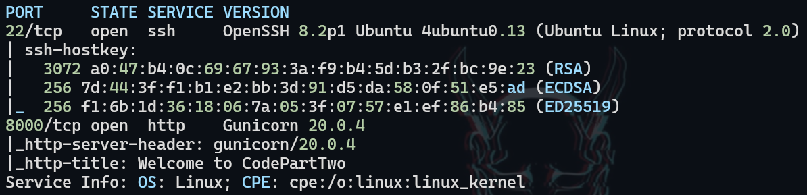
</figure>

## 2. Web Application Assessment

The web application running on port 8000 is a platform for executing JavaScript code online.

<figure style="text-align: center;">
    
</figure>

After registering and logging into the platform, I explored its functionality.

<figure style="text-align: center;">
    
</figure>

## 3. Source Code Analysis

The source code can be downloaded by clicking on `Download App`. The dashboard interface shows various functionalities available.

<figure style="text-align: center;">
    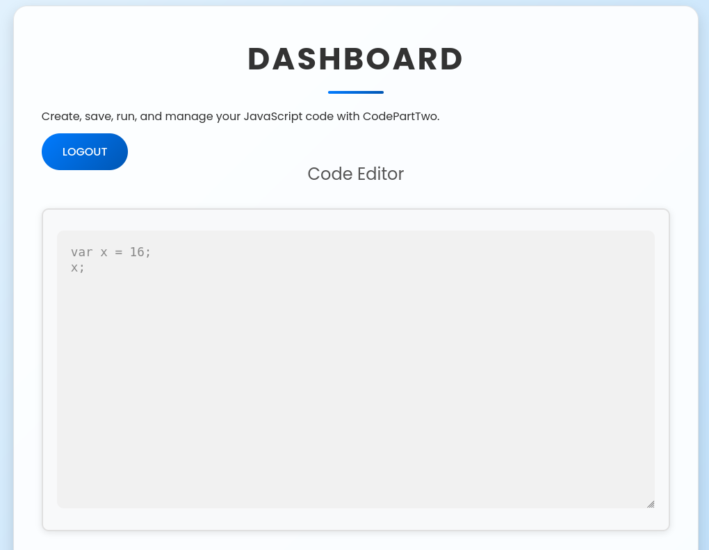
</figure>

After clicking `Download App`, a .zip file was downloaded and extracted for analysis.

<figure style="text-align: center;">
    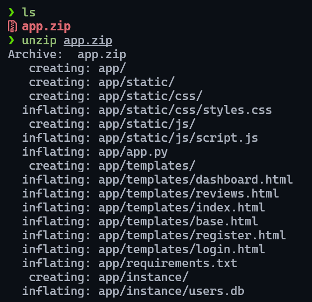
</figure>

The .db file appears to be empty in the downloaded package.

<figure style="text-align: center;">
    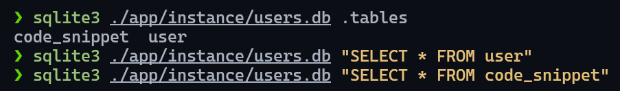
</figure>

## 4. Technology Stack Identification

The versions of technologies running behind the web application were identified.

<figure style="text-align: center;">
    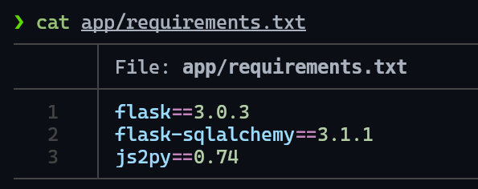
</figure>

## 5. Vulnerability Identification & Exploitation

Research revealed a vulnerability in the js2py version: CVE-2024-28397 - Sandbox Escape
Reference: https://github.com/Marven11/CVE-2024-28397-js2py-Sandbox-Escape

<figure style="text-align: center;">
    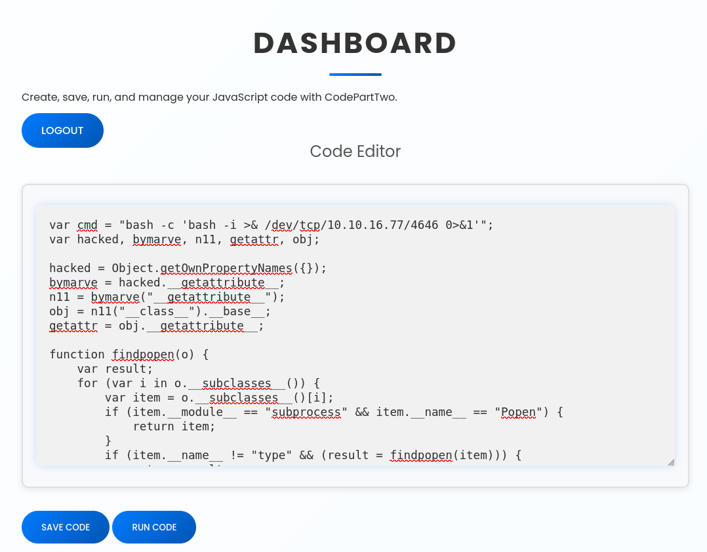
</figure>

The payload was modified to send a reverse shell. After clicking `Run Code` while listening on the specified port, a reverse shell was successfully received.

<figure style="text-align: center;">
    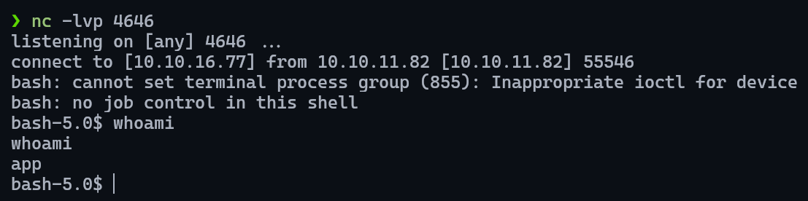
</figure>

## 6. Database Analysis & Credential Extraction

Once inside the machine, information that was empty in the .zip file was recovered from the server. An MD5 hashed password for user `marco` was found.

<figure style="text-align: center;">
    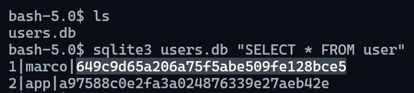
</figure>

<figure style="text-align: center;">
    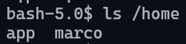
</figure>

The password was cracked using crackstation.net.

<figure style="text-align: center;">
    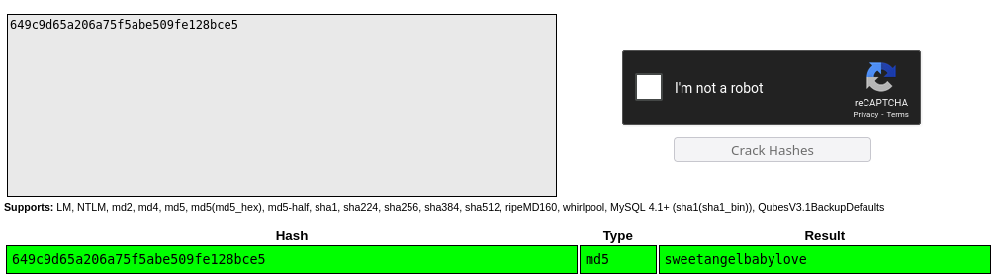
</figure>

## 7. User Pivoting

Since SSH service is active, connection was attempted using marco's credentials.

```bash
ssh marco@10.10.11.82
```

<figure style="text-align: center;">
    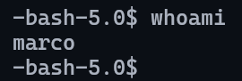
</figure>

The user flag was obtained:

```bash
cat user.txt
```

## 8. Privilege Escalation Analysis

SUID permissions were examined and revealed that `npbackup-cli` can be executed as root. This is a command-line backup tool.

<figure style="text-align: center;">
    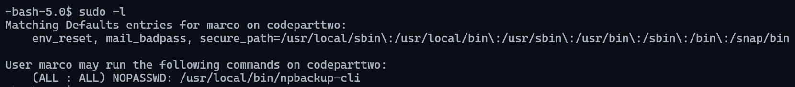
</figure>

In the same directory, a ``.conf`` file owned by root was found.

<figure style="text-align: center;">
    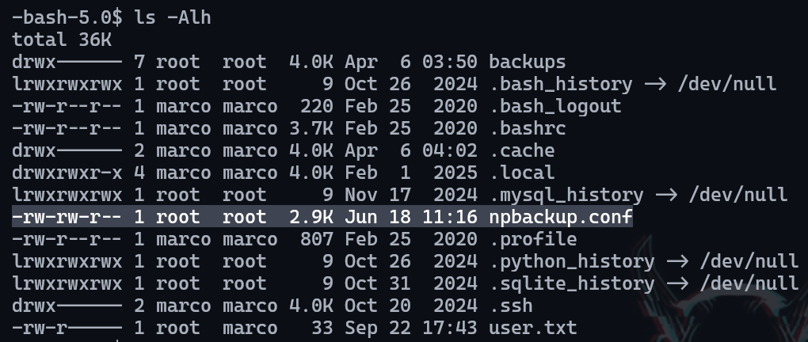
</figure>

## 9. Configuration File Exploitation

Examination of the configuration file revealed an interesting feature - commands can be executed before performing the backup.

<figure style="text-align: center;">
    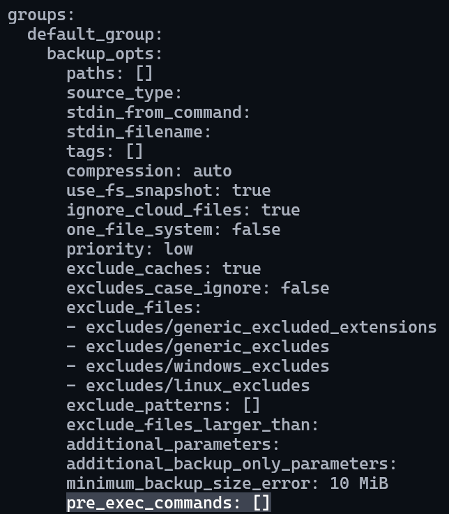
</figure>

Since the file wasn't owned by the current user, it was copied to allow modification and addition of code to establish a reverse shell.

<figure style="text-align: center;">
    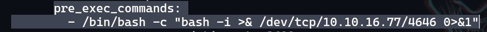
</figure>

<figure style="text-align: center;">
    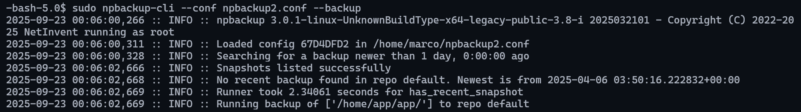
</figure>

## 10. Root Access Achievement

On the listening port, the shell was received as root and the root flag was successfully read.

<figure style="text-align: center;">
    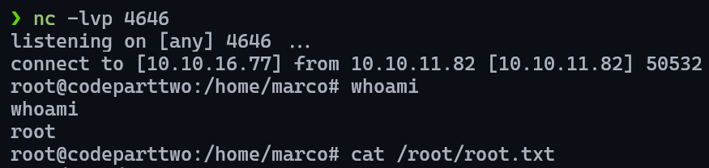
</figure>

---

## Recommendations

### Immediate Actions

1. **JavaScript Execution Platform Security**
   - Update js2py to latest version
   - Apply security patches for CVE-2024-28397
   - Implement proper sandboxing for code execution
   - Restrict file system access for executed code

2. **Application Security**
   - Remove source code download functionality
   - Encrypt sensitive database contents
   - Implement proper access controls for database files

3. **System Hardening**
   - Remove or restrict SUID permissions on `/usr/bin/npbackup-cli`
   - Implement proper configuration file access controls
   - Review and restrict command execution capabilities in backup tools

### Long-term Security Improvements

1. **Access Controls**
   - Implement principle of least privilege for all system binaries
   - Regular audit of SUID/SGID binaries
   - Proper file permissions for configuration files

2. **Code Execution Environment**
   - Implement containerized execution environment
   - Use proper chroot jails or similar isolation mechanisms
   - Regular security assessments of code execution platforms

3. **Monitoring & Detection**
   - Implement logging for backup operations
   - Monitor configuration file modifications
   - Deploy intrusion detection systems
   - Regular vulnerability assessments and penetration testing