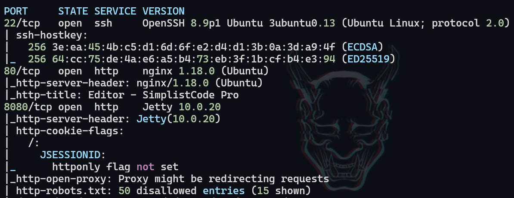
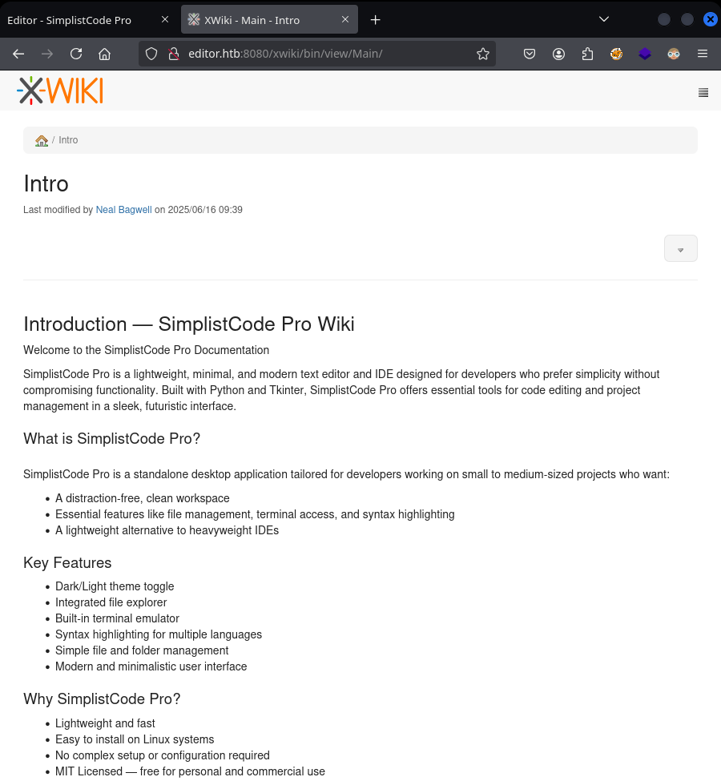
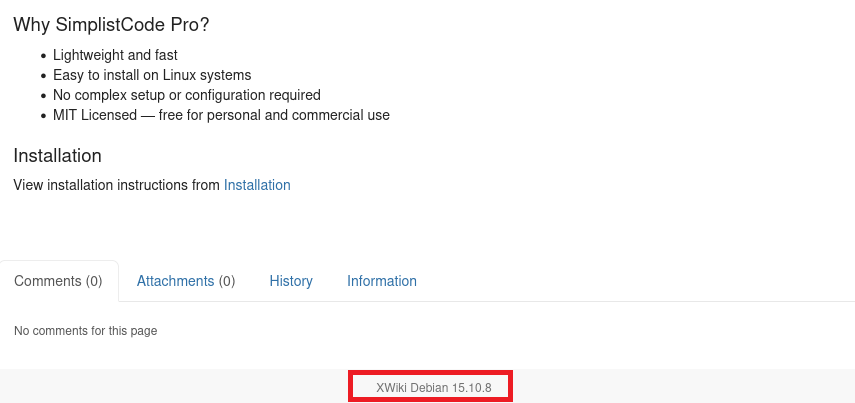
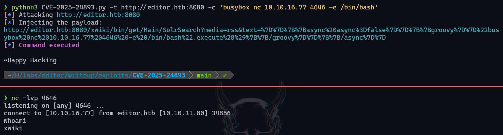
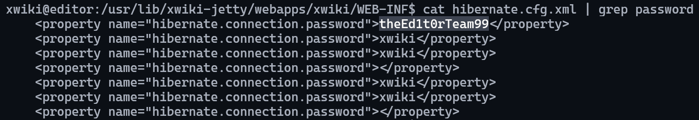
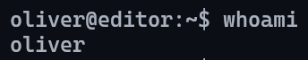
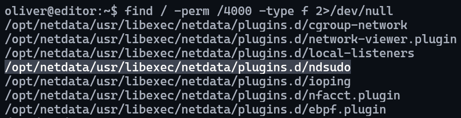
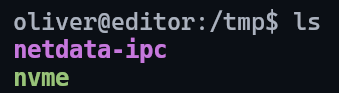
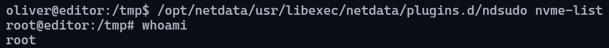

# Editor

___

**Key Findings:**
- XWiki 15.10.8 Remote Code Execution vulnerability (CVE-2025-24893)
- Database credentials exposed in configuration files
- Netdata ndsudo binary with SUID permissions
- Path hijacking vulnerability in ndsudo plugin execution (CVE-2024-32019)
- SSH service accessible with recovered credentials

---

## Key Learning Objectives

✅ Port Scanning & Service Enumeration  
✅ XWiki Version Identification & Exploitation - CVE-2025-24893  
✅ Database Credential Extraction  
✅ SSH Lateral Movement Techniques  
✅ SUID Binary Discovery & Analysis  
✅ Path Hijacking Privilege Escalation - CVE-2024-32019

---

## 1. Reconnaissance & Enumeration

Initial reconnaissance was conducted using Nmap to identify open ports and running services across the full port range.

```bash
sudo nmap -p- --open -n -Pn -vvv -oG ports 10.10.11.80
sudo nmap -p 22,80,8080 -oN services 10.10.11.80
```

**Results:**
- Port 22/tcp: SSH service
- Port 80/tcp: Apache HTTP server
- Port 8080/tcp: XWiki application

<figure style="text-align: center;">
    
</figure>

## 2. Web Application Assessment

### Primary Web Service (Port 80)

Initial analysis of the web service running on port 80 revealed a standard web application interface.

<figure style="text-align: center;">
    
</figure>

### XWiki Discovery (Port 8080)

Further enumeration revealed an XWiki installation running on port 8080, which proved to be the primary attack vector for this machine.

<figure style="text-align: center;">
    
</figure>

## 3. Vulnerability Identification

### Version Discovery

Critical version information was discovered in the footer of the XWiki application, revealing version 15.10.8.

<figure style="text-align: center;">
    
</figure>

### CVE-2025-24893 Research

Research into XWiki version 15.10.8 revealed a critical Remote Code Execution vulnerability documented as CVE-2025-24893. A working exploit was found in the following repository: https://github.com/gunzf0x/CVE-2025-24893

## 4. Initial Exploitation

The exploit repository was cloned and the RCE vulnerability was successfully leveraged to establish a reverse shell on the target system.

<figure style="text-align: center;">
    
</figure>

## 5. Post-Exploitation Enumeration

### Credential Discovery

Post-exploitation enumeration revealed database credentials stored in XWiki configuration files. These credentials provided valuable information for further system access.

<figure style="text-align: center;">
    
</figure>

<figure style="text-align: center;">
    
</figure>

## 6. Lateral Movement

### SSH Access

With the recovered credentials, SSH access was attempted and successfully established to the user account `oliver`.

```bash
ssh oliver@editor.htb
```

<figure style="text-align: center;">
    
</figure>

The user flag was successfully retrieved upon gaining legitimate user-level access to the system.

## 7. Privilege Escalation

### SUID Binary Discovery

Systematic enumeration of SUID binaries revealed a potentially vulnerable Netdata plugin located at `/opt/netdata/usr/libexec/netdata/plugins.d/ndsudo`.

<figure style="text-align: center;">
    
</figure>

### CVE-2024-32019 Research

Research into the ndsudo binary revealed a path hijacking vulnerability documented as CVE-2024-32019. A working proof of concept was found at: https://github.com/AzureADTrent/CVE-2024-32019-POC

### Exploit Compilation and Transfer

The exploit required compilation and transfer to the target system:

```bash
gcc poc.c -o nvme
scp nvme oliver@editor.htb:/tmp/
```

<figure style="text-align: center;">
    
</figure>

### Path Hijacking Execution

Once the compiled exploit was transferred to `/tmp`, executable permissions were granted and a path hijacking attack was performed:

```bash
chmod +x /tmp/nvme
export PATH=/tmp:$PATH
```

### Root Access

The ndsudo binary was executed, successfully triggering the path hijacking vulnerability and granting root access:

```bash
/opt/netdata/usr/libexec/netdata/plugins.d/ndsudo nvme-list
```

<figure style="text-align: center;">
    
</figure>

---

## Recommendations

### Immediate Actions

1. **Update XWiki Installation**
   - Update XWiki to the latest patched version
   - Apply security patches for CVE-2025-24893
   - Restrict access to XWiki administrative interfaces

2. **Secure Configuration Files**
   - Remove or encrypt database credentials in configuration files
   - Implement proper file permissions for sensitive configuration data
   - Regular audit of exposed credentials

3. **System Hardening**
   - Remove or update vulnerable ndsudo binary
   - Apply patches for CVE-2024-32019
   - Review and minimize SUID binaries on the system

### Long-term Security Improvements

1. **Access Controls**
   - Implement network segmentation
   - Apply principle of least privilege for system binaries
   - Regular review of SUID permissions

2. **Monitoring**
   - Deploy system monitoring for unusual binary execution
   - Implement alerting for configuration file access
   - Monitor for suspicious SSH login attempts

3. **Regular Security Assessments**
   - Conduct periodic vulnerability assessments
   - Keep all applications and systems updated with latest security patches
   - Implement secure development practices for web applications