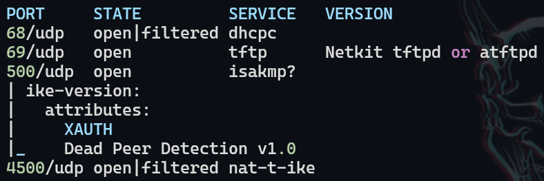
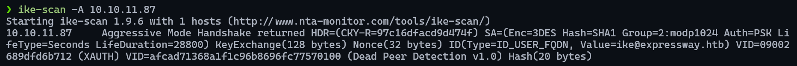
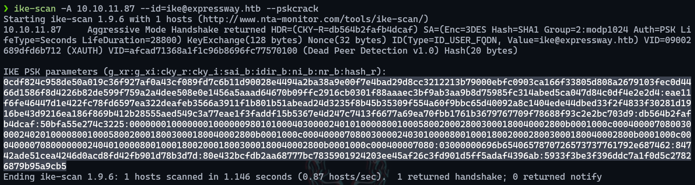
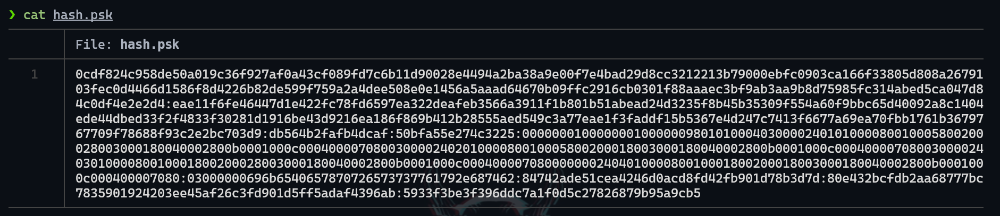
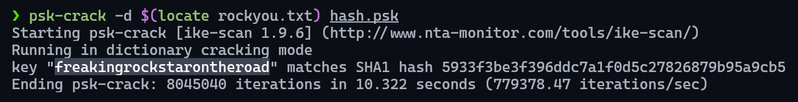
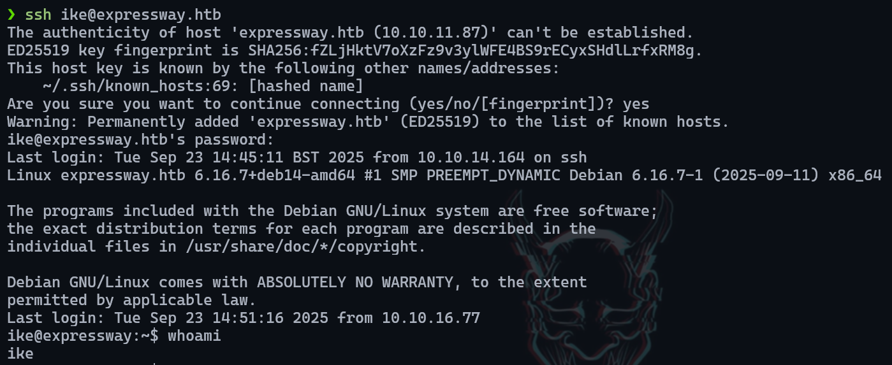
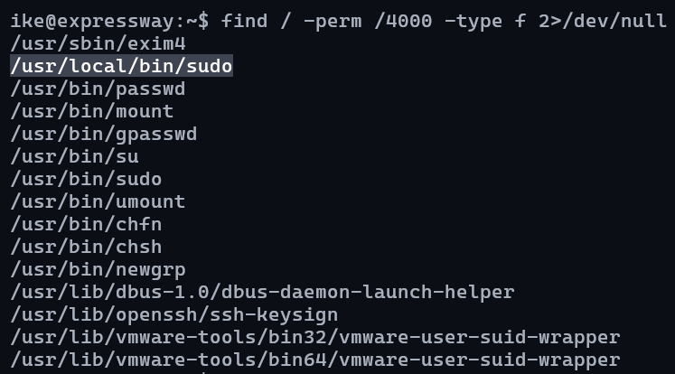
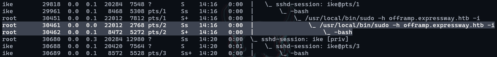
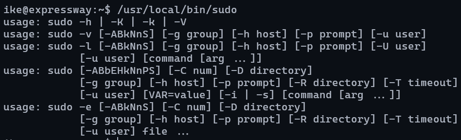
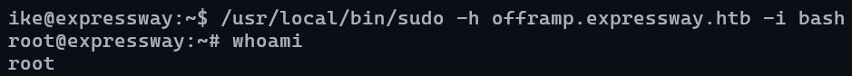

# Expressway

___

**Key Findings:**
- ISAKMP service running on UDP port 500
- IKE aggressive mode vulnerability exposing PSK hash
- Pre-Shared Key (PSK) crackable hash disclosure
- User enumeration via IKE service leakage
- SUID sudo binary privilege escalation
- Weak PSK credentials enabling system compromise

---

## Key Learning Objectives

✅ UDP Port Discovery & Service Enumeration  
✅ ISAKMP/IKE Protocol Analysis  
✅ IKE Aggressive Mode Exploitation  
✅ PSK Hash Extraction & Cracking  
✅ User Enumeration via Service Information Disclosure  
✅ SUID Binary Privilege Escalation  

---

## 1. Reconnaissance & Enumeration

Initial reconnaissance was conducted using Nmap to identify open ports and running services. The standard TCP scan revealed only SSH running on port 22, prompting further UDP enumeration.

**TCP Scan Results:**
- Port 22/tcp: SSH service

**UDP Scan Results:**
A targeted UDP scan was performed using the top 100 ports:

```bash
sudo nmap --top-ports=100 --open -sU -n -Pn -vvv -oG ports 10.10.11.87
sudo nmap -p 68,69,500,4500 -sU -sCV -oN services 10.10.11.87
```

The scan revealed port 500 running ISAKMP (Internet Security Association and Key Management Protocol), which serves as the foundation for IPsec VPN connections.

<figure style="text-align: center;">
    
</figure>

## 2. ISAKMP/IKE Service Analysis

Further analysis of the ISAKMP service was conducted using `ike-scan` to identify the IKE configuration and potential vulnerabilities:

```bash
ike-scan -A 10.10.11.87
```

<figure style="text-align: center;">
    
</figure>

The scan revealed that the IKE service is configured in **aggressive mode**, which represents a critical security vulnerability. Aggressive mode exchanges expose sensitive information, including Pre-Shared Key (PSK) hashes, making them susceptible to offline brute-force attacks.

## 3. IKE Aggressive Mode Exploitation

### PSK Hash Extraction

The aggressive mode configuration allows for PSK hash extraction through a targeted scan with a crafted identity:

```bash
ike-scan -A 10.10.11.87 --id=ike@expressway.htb --pskcrack
```

<figure style="text-align: center;">
    
</figure>

The scan successfully extracted the PSK hash, revealing both the hash value and a potential username (`iker`) through service information disclosure.

### Hash Cracking

The extracted hash was saved to a `.psk` file for offline cracking:

<figure style="text-align: center;">
    
</figure>

Using `psk-crack`, the PSK was successfully recovered:

<figure style="text-align: center;">
    
</figure>

## 4. User Access & Initial Compromise

### SSH Authentication

With the recovered PSK serving as a potential password and the leaked username `iker`, SSH authentication was attempted:

<figure style="text-align: center;">
    
</figure>

The credentials proved valid, granting initial access to the system as user `iker`.

## 5. Privilege Escalation

### SUID Binary Discovery

System enumeration revealed the presence of SUID binaries, with particular focus on `sudo`:

<figure style="text-align: center;">
    
</figure>

### Process Analysis

Process examination using `ps -faux` revealed that sudo is running with specific flags `-h` and `-i`:

<figure style="text-align: center;">
    
</figure>

### Flag Analysis & Exploitation

Investigation of the sudo flags revealed their functionality:
- `-h`: Specifies the host
- `-i`: Specifies the command to execute

<figure style="text-align: center;">
    
</figure>

Given the SUID permissions on the sudo binary, executing a bash shell resulted in privilege escalation to root:

<figure style="text-align: center;">
    
</figure>

---

## Recommendations

### Immediate Actions

1. **IKE/ISAKMP Configuration**
   - Disable IKE aggressive mode immediately
   - Implement main mode with proper authentication
   - Change all Pre-Shared Keys to strong, randomly generated values

2. **Access Controls**
   - Remove SUID permissions from sudo binary if not required
   - Implement proper sudo configuration with restricted commands
   - Review and harden SSH configuration

3. **Network Security**
   - Consider blocking UDP port 500 if VPN functionality is not required
   - Implement network segmentation to limit exposure

### Long-term Security Improvements

1. **VPN Security**
   - Migrate to certificate-based authentication instead of PSK
   - Implement proper IKE policies with strong encryption algorithms
   - Regular rotation of cryptographic keys and certificates

2. **System Hardening**
   - Regular audit of SUID/SGID binaries
   - Implement principle of least privilege for system binaries
   - Deploy monitoring for privilege escalation attempts

3. **Monitoring & Detection**
   - Implement network monitoring for IKE/ISAKMP traffic
   - Deploy intrusion detection systems to identify exploitation attempts
   - Monitor for unusual privilege escalation activities

4. **Regular Security Assessments**
   - Conduct periodic network vulnerability scans including UDP ports
   - Perform regular penetration testing of VPN infrastructure
   - Review and update VPN security configurations quarterly