# Outbound

___

**Key Findings:**
- RoundCube webmail vulnerability (CVE-2025-49113)
- MySQL credentials exposed in configuration files
- Encrypted session data containing user credentials
- Triple DES encryption with exposed key in configuration
- Mail system information disclosure
- Sudo privilege escalation via `/usr/bin/below` binary (CVE-2025-27591)

---

## Key Learning Objectives

✅ Web Enumeration & Virtual Host Discovery  
✅ RoundCube Exploitation - CVE-2025-49113  
✅ Database Analysis & Session Data Extraction  
✅ Triple DES Decryption Techniques  
✅ Mail System Information Gathering  
✅ Below Binary Privilege Escalation - CVE-2025-27591

---

## 1. Reconnaissance & Enumeration

Initial reconnaissance was conducted using Nmap to identify open ports and running services.

**Results:**
- Port 22/tcp: SSH service
- Port 80/tcp: Apache HTTP server

<figure style="text-align: center;">
    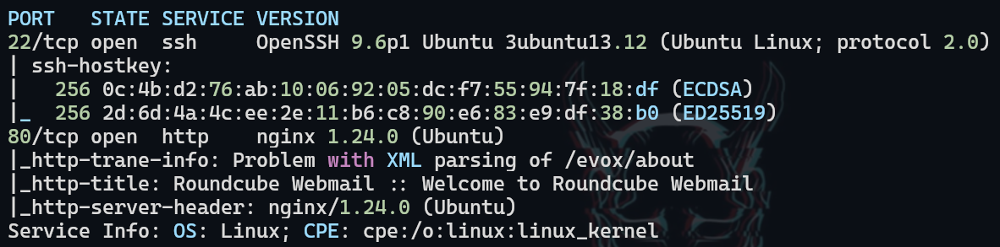
</figure>

In `/etc/hosts` we add `<IP> mail.outbound.htb` since when loading the page it redirects us there.

<figure style="text-align: center;">
    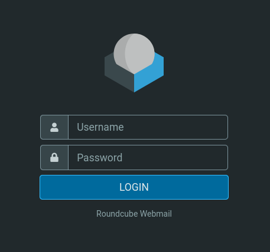
</figure>

## 2. Web Application Assessment

With the credentials that were provided to us, we log in. We see the technology being used as well as its version.

<figure style="text-align: center;">
    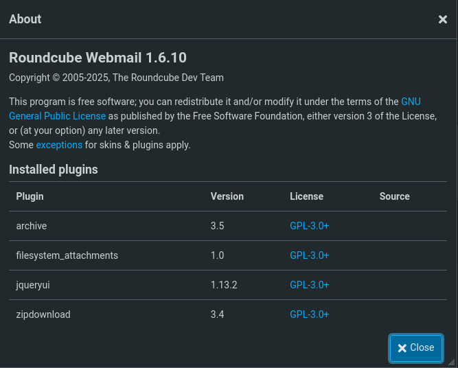
</figure>

## 3. Vulnerability Identification & Exploitation

We search for possible exploits and found one: https://github.com/hakaioffsec/CVE-2025-49113-exploit
We download it and use it, then we get a reverse shell.

<figure style="text-align: center;">
    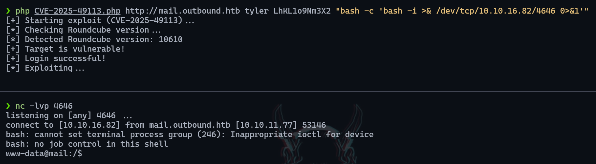
</figure>

## 4. Configuration File Analysis

Once inside we see the configuration file `/var/www/html/roundcube/config/config.inc.php` and find the following MySQL credentials:

<figure style="text-align: center;">
    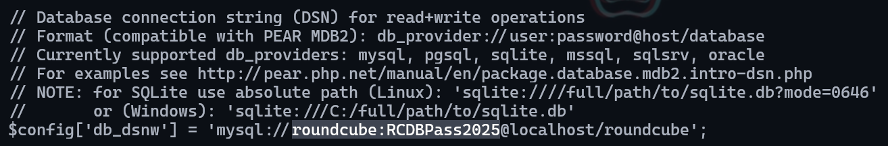
</figure>

We connect with these credentials to MySQL, use the `roundcube` database and find the following tables.

<figure style="text-align: center;">
    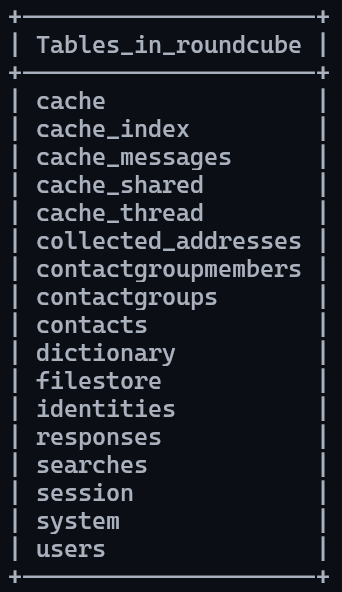
</figure>

## 5. Database Analysis & Session Decryption

In the session table we find the following base64 text, this data corresponds to sess_id, changed, ip and vars, that is, environment variables.

<figure style="text-align: center;">
    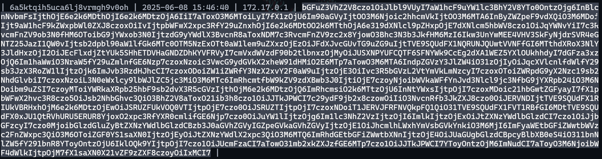
</figure>

We decode it and see that it belongs to user `jacob` and we also have a password.

<figure style="text-align: center;">
    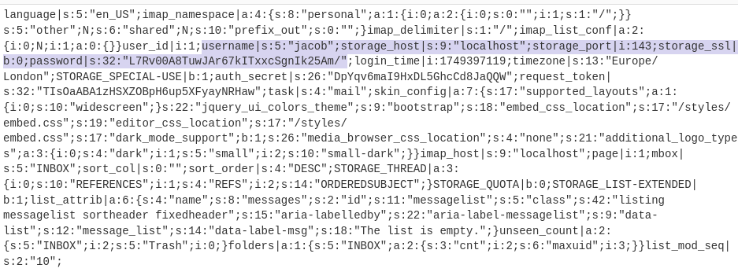
</figure>

Going back to the configuration file `config.inc.php` we can observe a des_key.

<figure style="text-align: center;">
    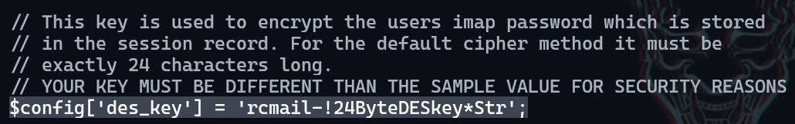
</figure>

We decode the password, and see that it is an encrypted password as we said before with DES, triple DES to be precise, we convert it to hex content, and the first 8 bytes will belong to IV.

<figure style="text-align: center;">
    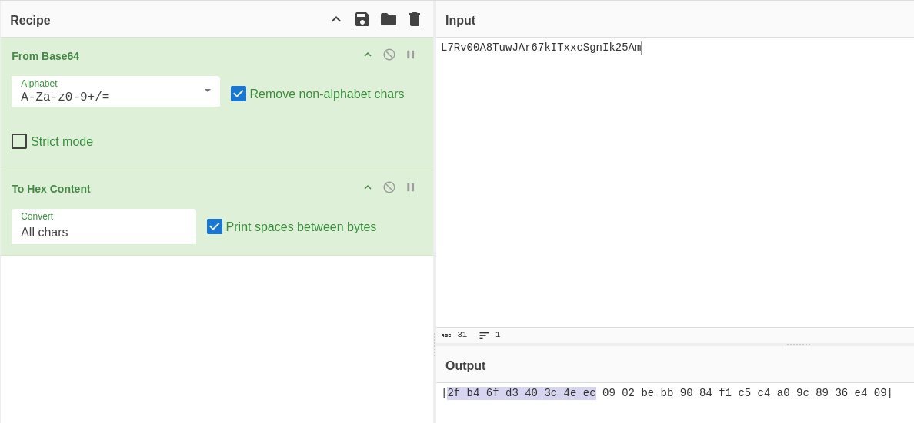
</figure>

The remaining 24 bytes correspond to the password, so it goes in the input, we also add the key and with that we manage to obtain the password.

<figure style="text-align: center;">
    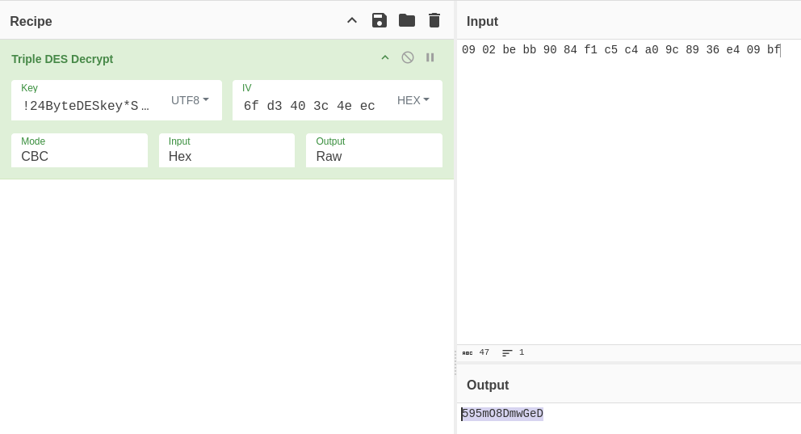
</figure>

## 6. User Pivoting

With the credentials we just obtained we switch to user `jacob`:

<figure style="text-align: center;">
    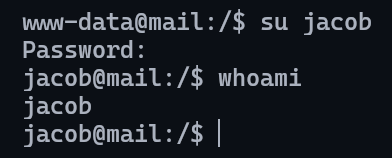
</figure>

## 7. Mail System Information Gathering

We have messages in `/var/mail/jacob`, in one from tyler, they mention that they changed our password and assigned us another one.

<figure style="text-align: center;">
    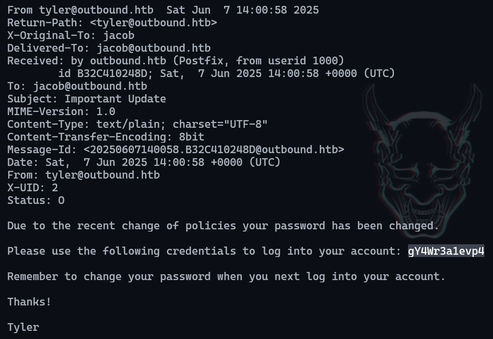
</figure>

We connect via SSH with jacob and the password they mention.

## 8. Privilege Escalation

We see what permissions we have at the SUDOERS level:

<figure style="text-align: center;">
    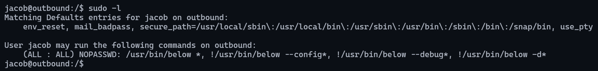
</figure>

And yes, we can execute `/usr/bin/below` as root. We download this exploit https://github.com/rvizx/CVE-2025-27591, execute it and we are already root.

<figure style="text-align: center;">
    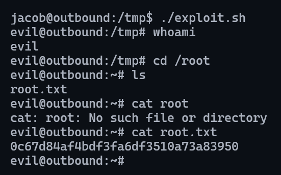
</figure>

---

## Recommendations

### Immediate Actions

1. **Secure RoundCube Installation**
   - Update RoundCube to latest version
   - Apply security patches for CVE-2025-49113
   - Restrict access to configuration files

2. **Database Security**
   - Change default MySQL credentials
   - Encrypt sensitive session data properly
   - Remove exposed DES keys from configuration files

3. **System Hardening**
   - Remove dangerous sudo permissions
   - Update `/usr/bin/below` binary or remove if unnecessary
   - Apply patches for CVE-2025-27591

### Long-term Security Improvements

1. **Access Controls**
   - Implement principle of least privilege
   - Regular review of sudo permissions and file access

2. **Monitoring**
   - Deploy log monitoring solutions
   - Implement alerting for configuration file access
   - Monitor mail system for information disclosure

3. **Regular Security Assessments**
   - Conduct periodic vulnerability assessments
   - Implement secure coding practices for web applications
   - Regular cryptographic key rotation