# Soulmate

___

**Key Findings:**
- CrushFTP service vulnerable to CVE-2025-31161 (User creation/authentication bypass)
- Default FTP service configuration exposing administrative interface
- Weak user access controls allowing password modification
- SSH service running on non-standard port 2222
- Exposed configuration files containing plaintext credentials
- Web application allowing arbitrary file upload leading to remote code execution (RCE)

---

## Key Learning Objectives

✅ Subdomain Enumeration & Virtual Host Discovery
✅ CrushFTP Exploitation - CVE-2025-31161
✅ Administrative Interface Manipulation
✅ User Account Takeover via Password Reset
✅ File Upload Vulnerability Exploitation
✅ Process Analysis & Configuration File Discovery
✅ Non-Standard SSH Service Identification

---

## 1. Reconnaissance & Enumeration

Initial reconnaissance was conducted using ``nmap`` to identify open ports and running services on the target system.

**Results:**
- Port 22/tcp: SSH service
- Port 80/tcp: Apache HTTP server

<figure style="text-align: center;">
    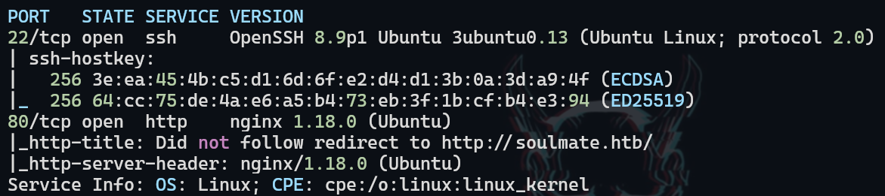
</figure>

We added `soulmate.htb` to our hosts file and examined the web application, finding no immediately relevant information.

<figure style="text-align: center;">
    
</figure>

## 2. Virtual Host Discovery

We performed subdomain enumeration to identify potential virtual hosts and additional attack surfaces.

<figure style="text-align: center;">
    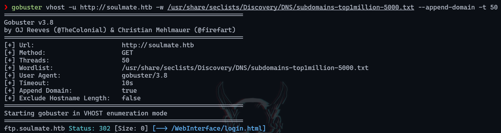
</figure>

The enumeration revealed the subdomain `ftp.soulmate.htb`, which we investigated further.

## 3. CrushFTP Service Discovery

Upon examining the discovered subdomain, we found a web service running CrushFTP technology.

<figure style="text-align: center;">
    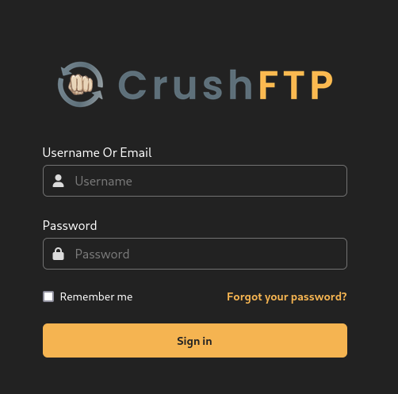
</figure>

## 4. Vulnerability Research & Exploitation

We searched for known exploits affecting CrushFTP and discovered a relevant proof-of-concept: https://github.com/Immersive-Labs-Sec/CVE-2025-31161

This exploit allows for unauthorized user creation, which we leveraged to gain initial access to the system.

<figure style="text-align: center;">
    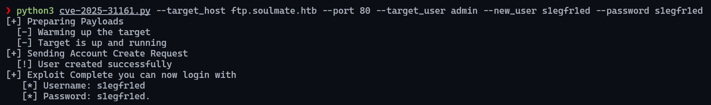
</figure>

## 5. Administrative Interface Access

Using the newly created credentials (`s1egfr1ed:s1egfr1ed`), we logged into the CrushFTP interface. We navigated to the administrative panel by clicking "admin" in the upper left corner, followed by "user manager" to view the user list.

<figure style="text-align: center;">
    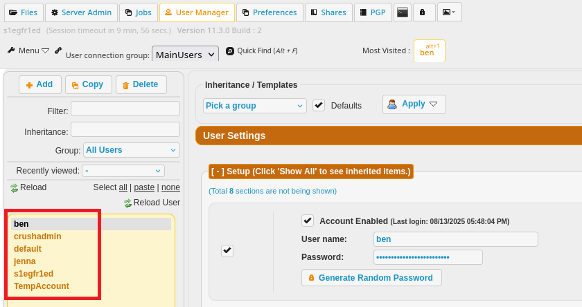
</figure>

We identified the user `ben` who had access to the `webProd` folder containing web application resources for `soulmate.htb`.

<figure style="text-align: center;">
    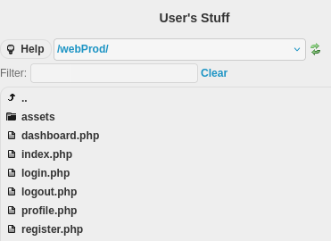
</figure>

## 6. User Account Takeover

We modified Ben's password and saved the changes to gain control of his account.

<figure style="text-align: center;">
    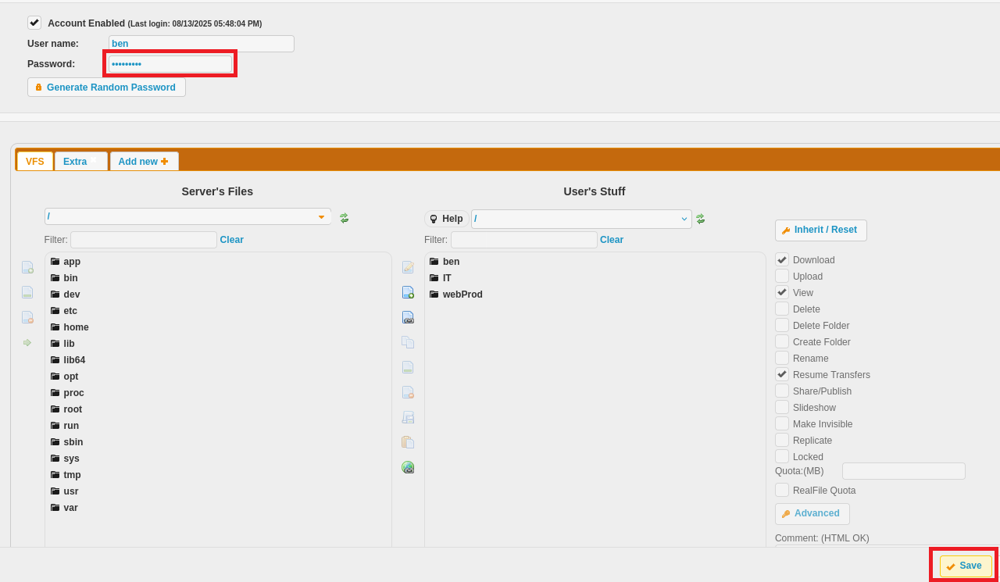
</figure>

After logging out and re-authenticating with Ben's compromised credentials, we gained access to his account privileges.

<figure style="text-align: center;">
  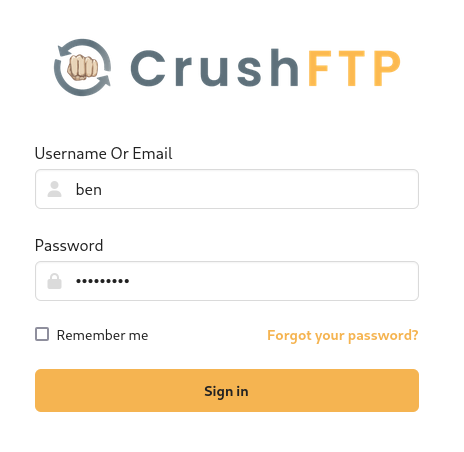
</figure>

## 7. File Upload & Remote Code Execution

We accessed the `webProd` directory through Ben's account.

<figure style="text-align: center;">
    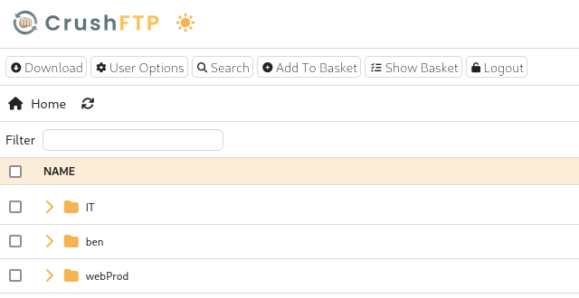
</figure>

We uploaded a malicious payload designed to establish a reverse shell connection.

<figure style="text-align: center;">
    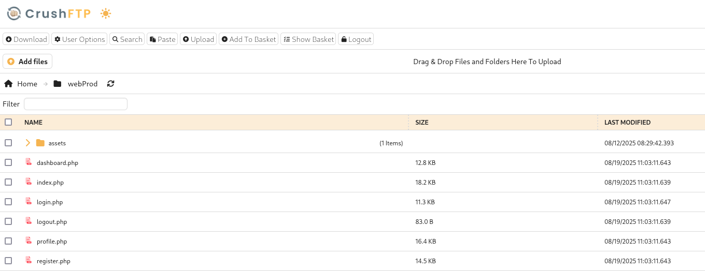
</figure>

<figure style="text-align: center;">
    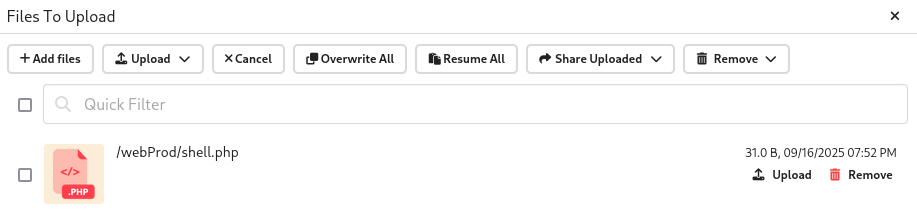
</figure>

## 8. Initial Foothold Establishment

Successfully executed the reverse shell payload to gain command line access to the target system.

<figure style="text-align: center;">
    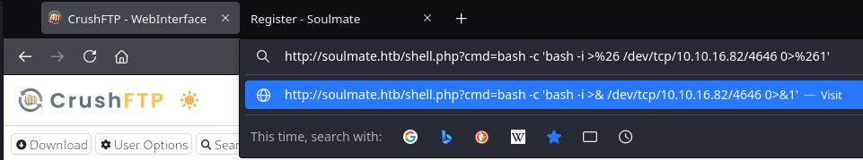
</figure>

<figure style="text-align: center;">
    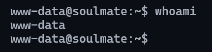
</figure>

## 9. Process Analysis & Credential Discovery

We examined running processes using `ps -faux` and discovered interesting service configurations.

<figure style="text-align: center;">
    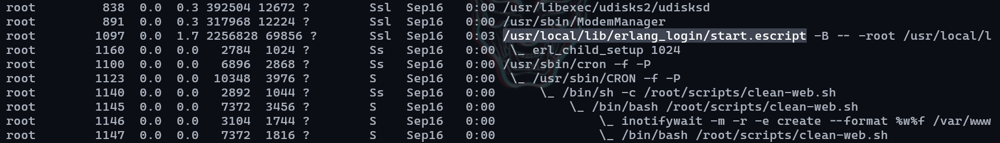
</figure>

Analysis of configuration files revealed Ben's credentials and indicated that SSH service was running on the non-standard port 2222.

<figure style="text-align: center;">
    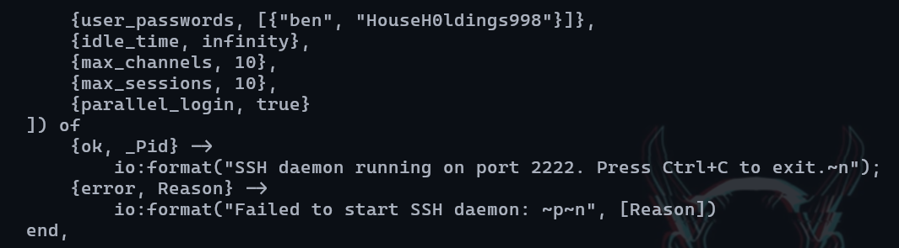
</figure>

## 10. SSH Service Access & Privilege Escalation

We confirmed the SSH service was listening on port 2222 and successfully authenticated using the discovered credentials, gaining access to an ``Erlang shell`` environment.

<figure style="text-align: center;">
    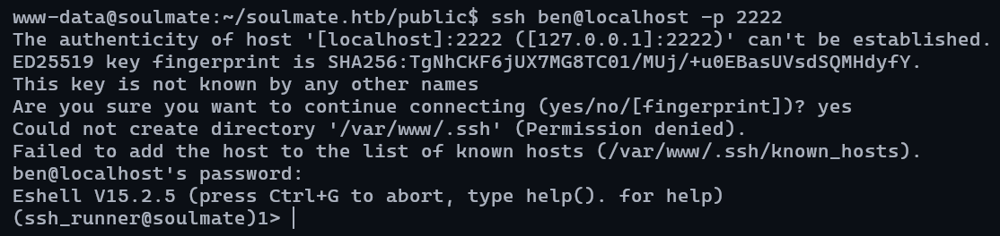
</figure>

## 11. Objective Achievement

Successfully obtained the user flag from the compromised system.

<figure style="text-align: center;">
    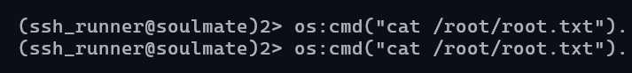
</figure>

---

## Recommendations

### Immediate Actions

1. **Update CrushFTP Installation**
   - Apply patches for CVE-2025-31161
   - Implement proper authentication controls
   - Restrict administrative interface access

2. **Access Control Hardening**
   - Implement principle of least privilege for user accounts
   - Remove ability for users to modify other user passwords
   - Enable proper audit logging for administrative actions

3. **File Upload Security**
   - Implement file type restrictions and validation
   - Deploy web application firewall rules
   - Restrict execution permissions on uploaded files

### Long-term Security Improvements

1. **Service Configuration**
   - Implement proper security to SSH service
   - Encrypt configuration files containing sensitive data
   - Implement secure credential storage mechanisms

2. **Monitoring & Detection**
   - Deploy intrusion detection systems
   - Monitor for unauthorized file uploads and executions
   - Implement alerting for administrative interface access

3. **Regular Security Assessments**
   - Conduct periodic vulnerability assessments
   - Implement secure development lifecycle practices
   - Regular review of user permissions and access controls