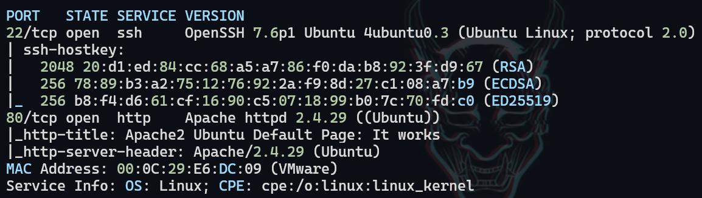
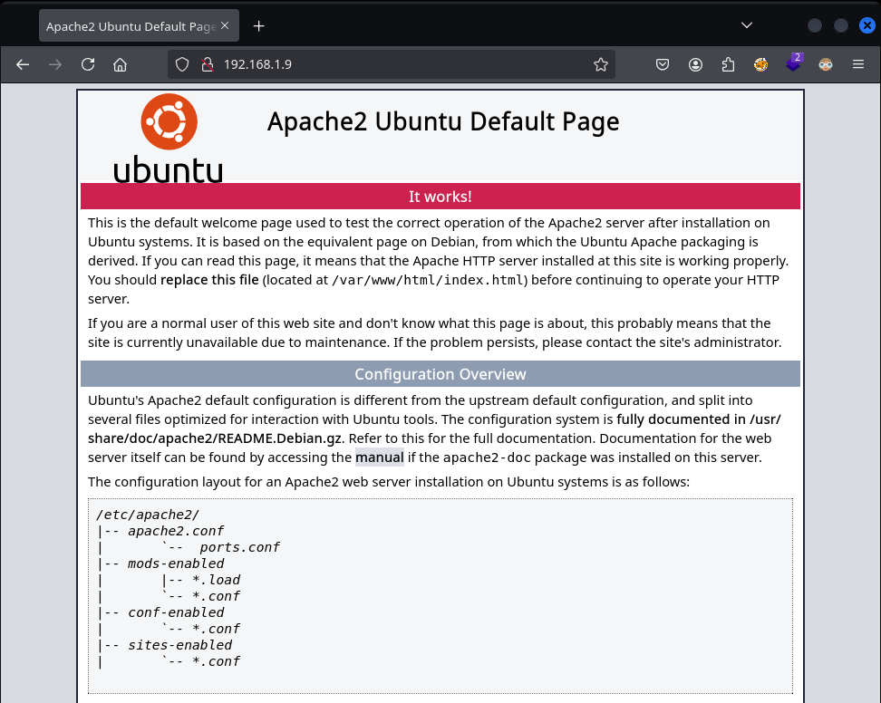
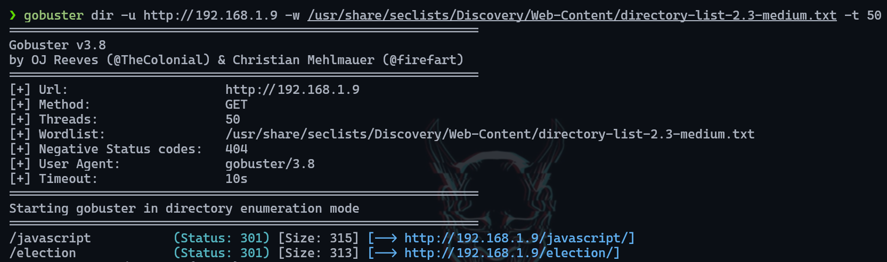
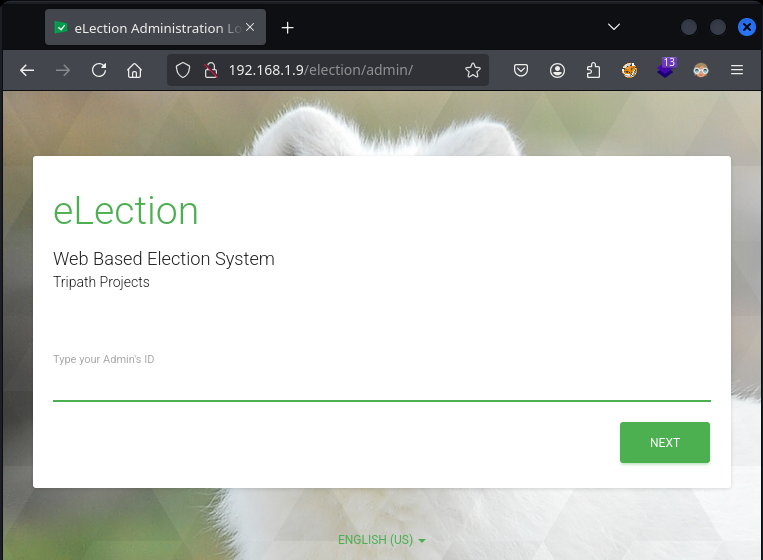
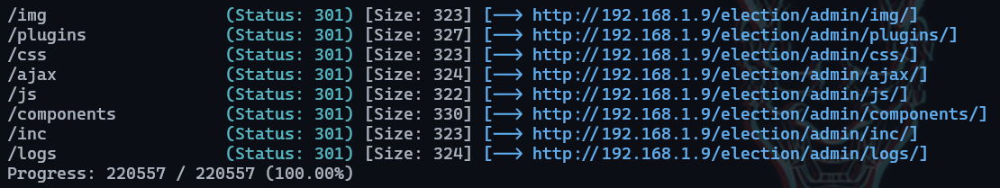
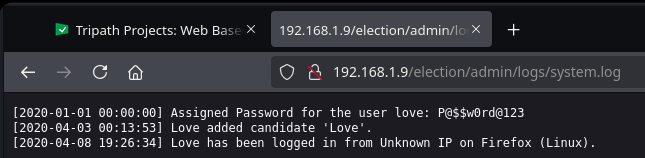
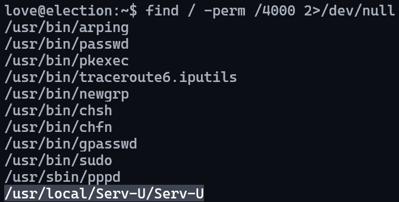
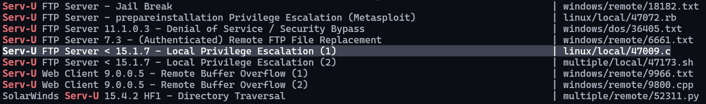
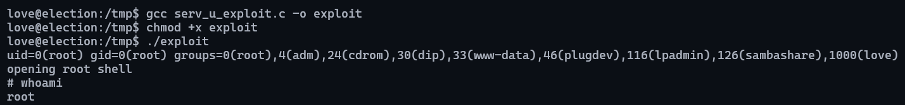

# Election

## Executive Summary

This report documents the penetration testing assessment of the "Election" VulnHub virtual machine. The assessment successfully achieved full system compromise through a combination of web enumeration, information disclosure vulnerabilities, and privilege escalation via a known CVE.

**Key Findings:**
- Information leakage through exposed log files
- Weak credential management
- Vulnerable Serv-U FTP service (CVE-2019-12181)

---

## Key Learning Objectives

✅ Web Enumeration  
✅ Information Leakage / Log Exposure  
✅ Serv-U 15.1.6 Privilege Escalation - CVE-2019-12181

---

## 1. Reconnaissance & Enumeration

Initial reconnaissance was conducted using Nmap to identify open ports and running services:

```bash
sudo nmap -p- --open -n -Pn -vvv -oG ports
```

**Results:**
- Port 22/tcp: SSH service
- Port 80/tcp: Apache HTTP server

<figure style="text-align: center;">
    
</figure>

Navigating to the web service revealed a default Apache2 installation page, indicating minimal customization of the web server.

<figure style="text-align: center;">
    
</figure>

Directory bruteforcing was performed to identify hidden directories and files:

**Discovery:** `/election` directory was identified.

<figure style="text-align: center;">
    
</figure>

## 2. Web Application Assessment

The `/election` directory contained a web application related to an election system.

<figure style="text-align: center;">
    
</figure>

Additional directory enumeration on `/election` revealed:
- `/admin` directory (no significant findings)

<figure style="text-align: center;">
    
</figure>

## 3. Vulnerability Identification

Additional directory enumeration showed a critical finding: The `admin/logs` directory was publicly accessible and contained sensitive system logs.

**Vulnerability:** Information Leakage through Log Exposure
**Location:** `/election/admin/logs/system.log`

<figure style="text-align: center;">
    
</figure>

Analysis of the `system.log` file revealed hardcoded credentials:

**Extracted Credentials:**
- Username: `love`
- Password: `P@$$w0rd@123`

<figure style="text-align: center;">
    
</figure>

## 4. Initial Access

The discovered credentials were tested against the SSH service:

```bash
ssh love@192.168.1.9
```

**Result:** Successful authentication achieved.

<figure style="text-align: center;">
    
</figure>

## 5. Privilege Escalation

Post-exploitation enumeration focused on identifying potential privilege escalation vectors:

**Discovery:** `serv-u` binary with SUID permissions was identified.

<figure style="text-align: center;">
    
</figure>

Using Searchsploit to identify known vulnerabilities:

```bash
searchsploit serv-u
```

**Result:** CVE-2019-12181 exploit available for Serv-U FTP Server.

<figure style="text-align: center;">
    
</figure>

The exploit was transferred to the target system, compiled, and executed:

```bash
gcc exploit.c -o exploit
./exploit
```

**Result:** Root privileges successfully obtained.

<figure style="text-align: center;">
    
</figure>

## Recommendations

### Immediate Actions

1. **Secure Log Files**
   - Restrict access to log directories
   - Implement proper file permissions

2. **Credential Management**
   - Remove hardcoded credentials from logs
   - Implement secure credential storage practices

3. **Service Updates**
   - Update Serv-U FTP Server to latest version
   - Apply security patches for CVE-2019-12181

### Long-term Security Improvements

1. **Access Controls**
   - Implement principle of least privilege
   - Regular review of file permissions and directory access

2. **Monitoring**
   - Deploy log monitoring solutions
   - Implement alerting for sensitive file access

3. **Regular Security Assessments**
   - Conduct periodic vulnerability assessments
   - Implement continuous security monitoring